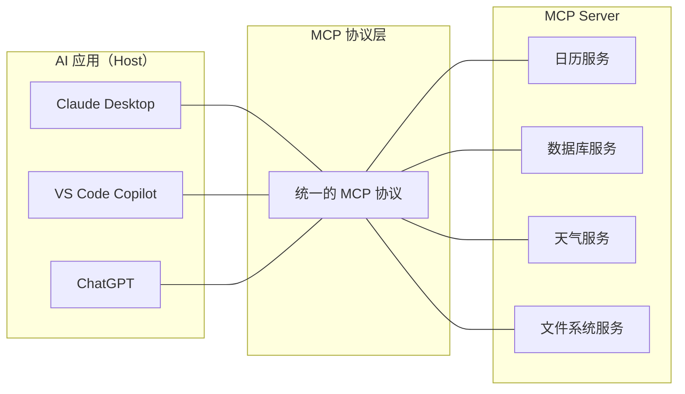
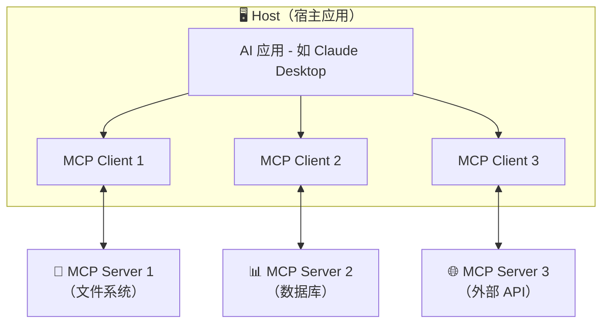

# 📖 01 — MCP 概述与入门

## 一句话理解 MCP

**MCP（Model Context Protocol，模型上下文协议）** 是 AI 应用和外部世界之间的"标准接口"——就像 USB-C 让各种设备通过同一种接口连接一样，MCP 让 AI 应用通过统一协议连接各种数据源和工具。

---

## 🤔 为什么需要 MCP？

### 没有 MCP 时的困境

想象你正在开发一个 AI 助手，需要让它能够：

- 读取用户的 Google 日历
- 查询公司数据库
- 调用天气 API
- 操作本地文件系统

**传统做法**：为每个数据源单独写集成代码。

```
AI 应用
  ├── Google Calendar 集成（自定义 API）
  ├── 数据库集成（自定义查询层）
  ├── 天气 API 集成（自定义 HTTP 客户端）
  └── 文件系统集成（自定义文件操作）
```

问题显而易见：

| 问题           | 具体表现                             |
| -------------- | ------------------------------------ |
| **重复造轮子** | 每个 AI 应用都要为同一个数据源写集成 |
| **碎片化**     | 不同应用的集成方式完全不同           |
| **维护成本**   | N 个应用 × M 个数据源 = N×M 套代码   |
| **安全参差**   | 每套集成的安全处理水平不一           |

### MCP 的解法

MCP 把 "N×M 问题" 变成 "N+M 问题"：



每个数据源只需实现一个 MCP Server，任何支持 MCP 的 AI 应用都能直接使用——就像你买一条 USB-C 线，就能给手机、平板、笔记本充电一样。

---

## 🏗️ MCP 的三个核心角色

MCP 定义了三个参与者，理解它们的关系是掌握 MCP 的基础：



### 1. Host（宿主 / 主机）

**是什么**：运行 AI 模型的应用程序，比如 Claude Desktop、VS Code 中的 Copilot。

**职责**：

- 管理多个 MCP Client 实例
- 协调 AI 模型与各个 Server 之间的交互
- 执行安全策略和用户授权
- 控制信息在不同 Server 之间的隔离

**类比**：Host 像一个"办公室经理"——统筹调度，但不亲自干活。

### 2. Client（客户端）

**是什么**：由 Host 创建的协议连接器，每个 Client 与一个 Server 保持 1:1 的会话。

**职责**：

- 与 Server 进行协议协商（版本、能力）
- 转发 Host 的请求给对应 Server
- 将 Server 的响应传回 Host

**类比**：Client 像"翻译官"——每个翻译官专门对接一个外部团队。

### 3. Server（服务器）

**是什么**：提供具体能力的程序，比如文件读写服务、数据库查询服务。

**职责**：

- 暴露工具（Tools）、资源（Resources）、提示词模板（Prompts）
- 响应 Client 的请求
- 独立运行，不感知其他 Server 的存在

**类比**：Server 像"专业服务商"——你是做天气预报的就只管天气，不需要知道客户还找了几家其他供应商。

---

## 🧩 MCP Server 提供什么？

MCP Server 通过三种核心原语（Primitive）向 AI 暴露能力：

| 原语          | 控制方   | 作用                | 现实类比             |
| ------------- | -------- | ------------------- | -------------------- |
| **Tools**     | 模型控制 | 可执行的函数/操作   | 餐厅菜单上的菜品     |
| **Resources** | 应用控制 | 可读取的数据/上下文 | 参考资料、文档       |
| **Prompts**   | 用户控制 | 预定义的提示词模板  | 标准化的操作流程模板 |

用一个"旅行助手"的例子来理解：

```
🌍 旅行规划 MCP Server

Tools（工具 - AI 主动调用）：
  - search_flights(from, to, date)    → 搜索航班
  - book_hotel(city, checkin, checkout) → 预订酒店
  - get_weather(city)                  → 查天气

Resources（资源 - 应用决定何时读取）：
  - travel://preferences               → 用户旅行偏好
  - travel://history                    → 历史行程记录
  - travel://budget                     → 预算信息

Prompts（模板 - 用户主动选择）：
  - plan_vacation(destination, days)    → "帮我规划 X 天的 Y 之旅"
  - compare_options(option_a, option_b) → "帮我对比两个方案"
```

三者的控制权分离是刻意为之的设计：

- **Tools 由模型控制**：AI 根据上下文自动判断何时调用
- **Resources 由应用控制**：Host 决定何时将数据纳入对话上下文
- **Prompts 由用户控制**：用户显式触发（如 `/plan_vacation`）

这种设计确保了安全性——AI 不能不经许可就读取你的数据，也不能未经确认就执行操作。

---

## 🌐 MCP 的生态系统

MCP 已被广泛采纳：

### 支持 MCP 的客户端（Host）

- **Claude Desktop** — Anthropic 官方桌面应用
- **VS Code** — GitHub Copilot 支持 MCP
- **Cursor** — AI 编程工具
- **ChatGPT** — OpenAI 的聊天界面
- 更多应用持续接入中…

### MCP 开发工具

- **TypeScript SDK** — 官方 TypeScript 开发包
- **Python SDK** — 官方 Python 开发包
- **MCP Inspector** — 调试和测试工具

### 可用的 MCP Server

社区已经构建了大量 MCP Server，覆盖文件系统、数据库、搜索引擎、代码仓库等各种场景。

---

## 🔑 关键设计原则

MCP 的设计遵循四条原则，理解它们有助于理解后续的很多技术决策：

### 1. Server 必须足够简单

> "让 Server 开发者只需关注业务逻辑，协议层面的复杂性由 Host/Client 承担。"

这就是为什么 MCP 的 Python SDK 用装饰器就能定义工具：

```python
@mcp.tool()
async def get_weather(city: str) -> str:
    """获取指定城市的天气信息"""
    return f"{city} 今天晴，25°C"
```

### 2. Server 必须高度可组合

多个 Server 可以无缝协作。Host 负责协调，Server 之间不需要相互感知。

### 3. Server 之间必须数据隔离

Server A 不能看到 Server B 的数据，也看不到完整的对话内容。Host 作为"守门人"控制信息边界。

### 4. 能力渐进添加

核心协议保持精简，高级功能通过能力协商（Capability Negotiation）按需启用。不需要的功能不会增加实现负担。

---

## 🚀 MCP 与 LSP 的渊源

MCP 的设计深受 **LSP（Language Server Protocol）** 启发。两者的对比有助于建立直觉：

| 维度         | LSP                    | MCP                        |
| ------------ | ---------------------- | -------------------------- |
| **解决问题** | 编辑器 × 编程语言 集成 | AI 应用 × 数据源/工具 集成 |
| **消息格式** | JSON-RPC 2.0           | JSON-RPC 2.0               |
| **架构**     | Client-Server          | Host-Client-Server         |
| **传输**     | stdio / pipe / socket  | stdio / Streamable HTTP    |
| **能力协商** | 有                     | 有                         |

MCP 在 LSP 的基础上做了关键改进：

- 引入 Host 层，支持一个应用管理多个 Server
- 增加了安全性设计（用户确认、数据隔离）
- 支持双向能力暴露（Server 可以请求 Client 的 AI 能力）

---

## 📌 小结

| 概念           | 要点                                              |
| -------------- | ------------------------------------------------- |
| MCP 的本质     | AI 应用与外部系统之间的标准化通信协议             |
| 解决的核心问题 | 将 N×M 的集成问题降为 N+M                         |
| 三个角色       | Host（宿主）、Client（客户端）、Server（服务端）  |
| 三种核心原语   | Tools（工具）、Resources（资源）、Prompts（模板） |
| 设计灵感       | Language Server Protocol（LSP）                   |

---

> 📖 **下一章**：[架构设计与原理](./02-architecture.md) — 深入理解 MCP 的三层架构和数据流。
