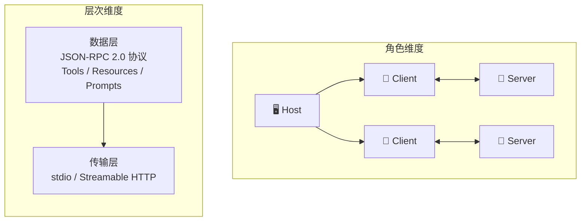
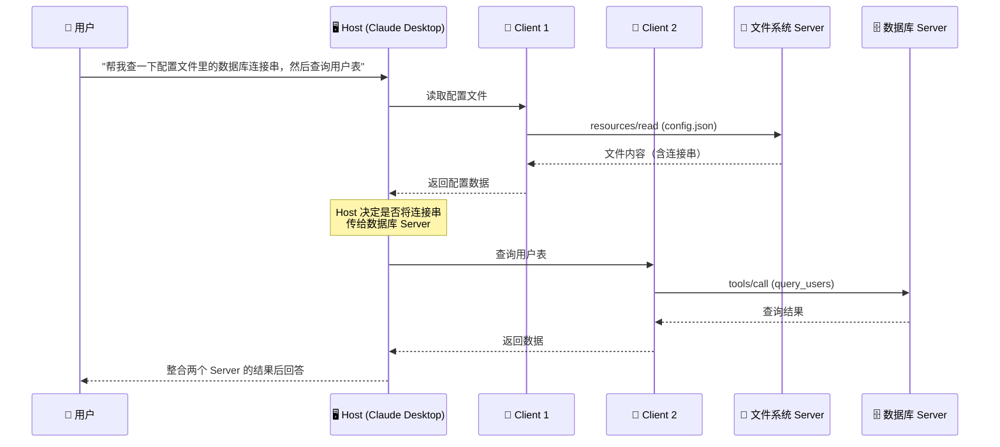
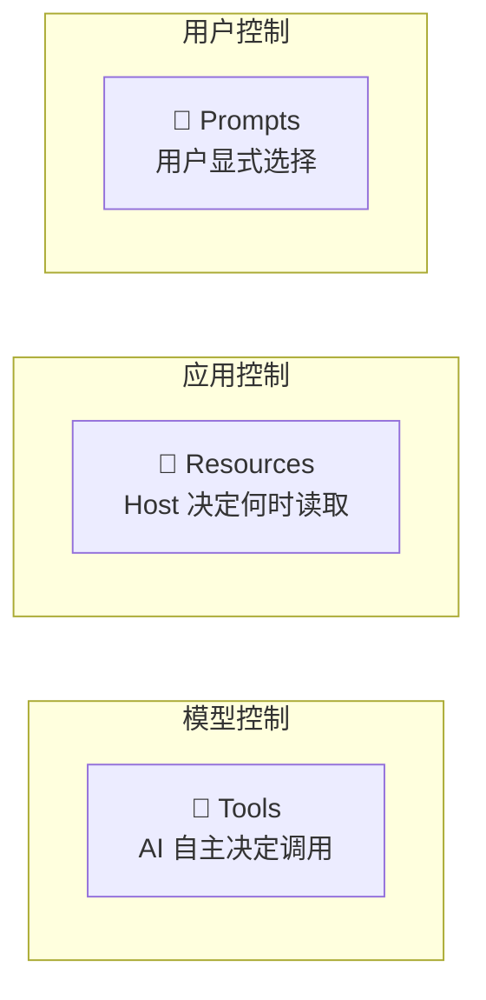
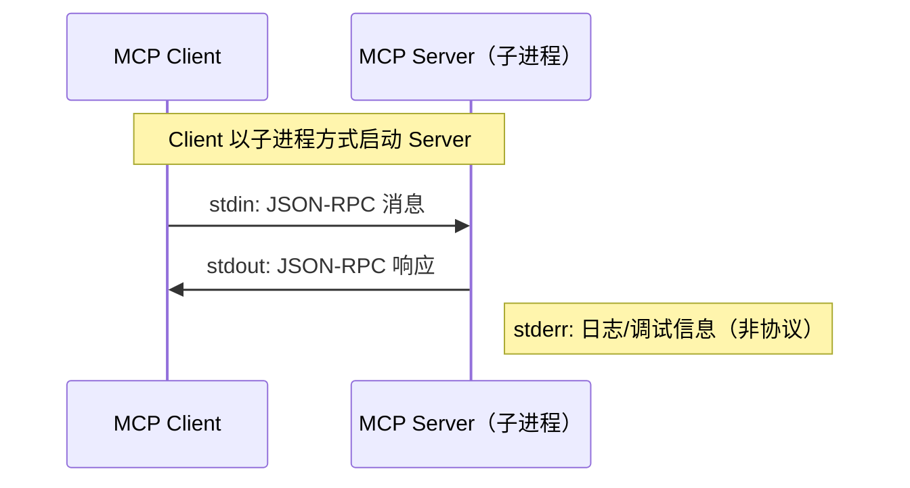
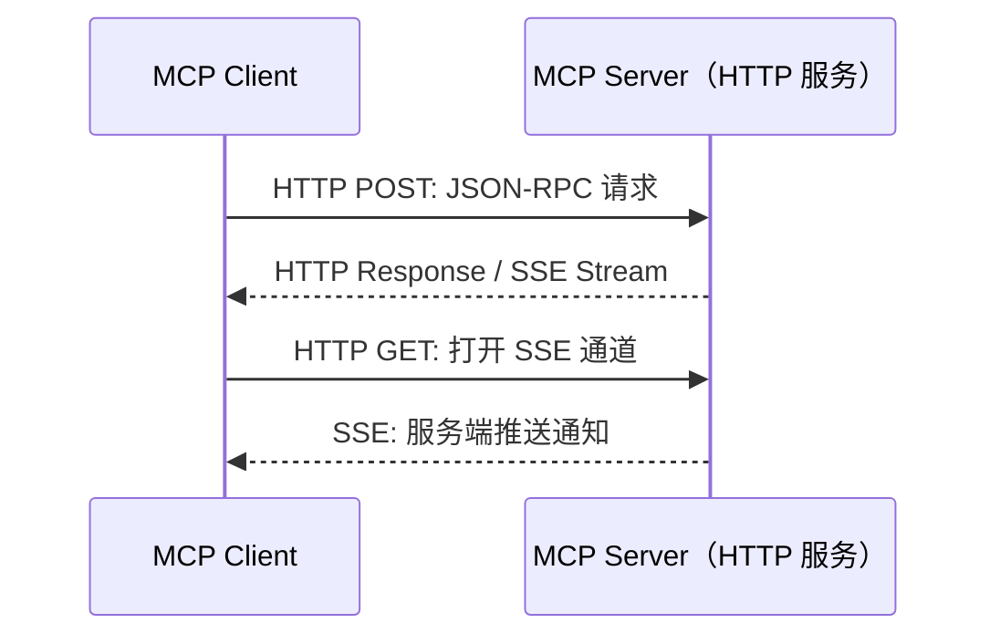
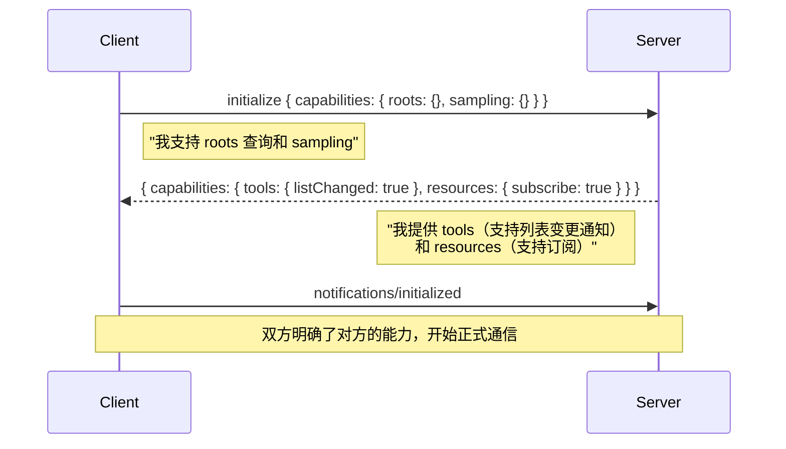
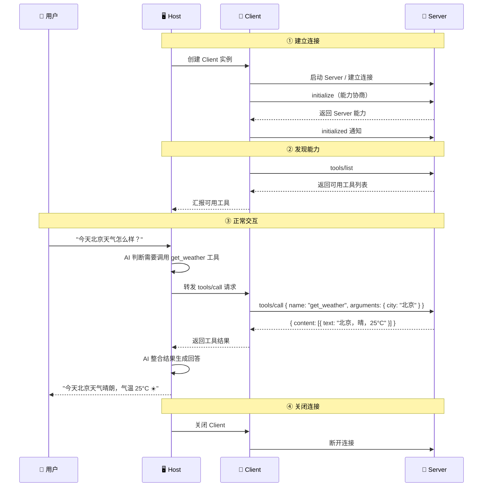

# 🏛️ 02 — 架构设计与原理

## 全局视角：MCP 的分层架构

MCP 的架构可以从两个维度理解：**角色维度**（谁参与）和**层次维度**（怎么通信）。



---

## 📐 角色模型详解

### Host-Client-Server 三层架构

为什么不是简单的 Client-Server 两层？看这个场景：

> 你在 Claude Desktop 中同时使用文件系统 Server 和数据库 Server。AI 在回答你的问题时，可能需要先从文件系统读取配置文件，再用配置中的连接串查询数据库。

如果只有两层，AI 应用要直接管理与多个 Server 的通信，处理它们之间的数据传递，还要确保安全隔离——这会变得非常复杂。

MCP 引入 Host 层来解决这个问题：



**关键观察**：文件系统 Server 和数据库 Server 之间没有直接通信。Host 作为中间人决定信息的流向。

### 各角色的职责边界

```
┌─────────────────────────────────────────────────┐
│ Host（宿主应用）                                 │
│                                                  │
│  职责：                                          │
│  ✅ 创建和管理 Client 实例                        │
│  ✅ 协调 AI 模型与多个 Server 的交互               │
│  ✅ 执行安全策略（用户授权、数据隔离）              │
│  ✅ 合并来自不同 Server 的信息                     │
│  ✅ 控制 Server 之间的信息可见性                   │
│                                                  │
│  ┌──────────────┐  ┌──────────────┐             │
│  │ Client 1     │  │ Client 2     │             │
│  │              │  │              │             │
│  │ 职责：       │  │ 职责：       │             │
│  │ ✅ 协议协商   │  │ ✅ 协议协商   │            │
│  │ ✅ 消息路由   │  │ ✅ 消息路由   │            │
│  │ ✅ 会话管理   │  │ ✅ 会话管理   │            │
│  └──────┬───────┘  └──────┬───────┘            │
│         │                  │                    │
└─────────┼──────────────────┼────────────────────┘
          │                  │
    ┌─────┴──────┐    ┌─────┴──────┐
    │ Server 1   │    │ Server 2   │
    │            │    │            │
    │ 职责：     │    │ 职责：     │
    │ ✅ 暴露能力 │    │ ✅ 暴露能力 │
    │ ✅ 响应请求 │    │ ✅ 响应请求 │
    │ ❌ 不感知   │    │ ❌ 不感知   │
    │   其他Server│    │   其他Server│
    └────────────┘    └────────────┘
```

---

## 📦 数据层：协议的核心

数据层定义了 Client 和 Server 之间交换的内容，基于 **JSON-RPC 2.0** 协议。

### Server 暴露的三种原语

这三种原语的设计反映了 AI 交互中三种不同的控制模式：



**为什么要区分三种控制模式？**

这是安全性和可控性的设计。不同操作的风险等级不同：

- **读取文档**（Resource）：低风险，应用可以自动决定
- **执行操作**（Tool）：中等风险，需要 AI 判断 + 人类确认
- **触发工作流**（Prompt）：由用户主动发起，最可控

### Client 暴露的能力

Client 也可以向 Server 暴露能力，形成双向通信：

| 能力          | 方向          | 作用                         |
| ------------- | ------------- | ---------------------------- |
| **Sampling**  | Server → Client | Server 请求 Client 的 AI 生成能力 |
| **Roots**     | Server → Client | Server 查询可访问的文件系统范围   |
| **Elicitation** | Server → Client | Server 请求用户提供额外信息     |

这种双向设计使得 Server 可以利用 Host 的 AI 能力，而不需要自己集成 LLM——大大降低了 Server 的开发门槛。

---

## 🔌 传输层：通信机制

传输层负责"如何发送消息"，MCP 支持两种传输方式：

### stdio（标准输入/输出）



**适用场景**：本地运行，如 Claude Desktop 启动本地文件系统 Server。

**优势**：
- 无需网络配置
- 进程级隔离，安全性好
- 启动简单，一行命令搞定

### Streamable HTTP



**适用场景**：远程部署的 Server，如云端的数据库查询服务。

**优势**：
- 支持远程访问
- 支持多客户端并发
- 支持认证和授权
- 支持消息重传和断线重连

### 如何选择？

| 考量         | stdio          | Streamable HTTP   |
| ------------ | -------------- | ----------------- |
| 部署位置     | 本地           | 本地或远程        |
| 客户端数量   | 单个           | 多个              |
| 安全需求     | 进程隔离即可   | 需要 OAuth 等     |
| 网络要求     | 无             | 需要              |
| 典型场景     | IDE 插件       | 云服务、企业 API  |

---

## 🔄 能力协商机制

能力协商是 MCP 的精华设计之一。它让协议的实现者可以**按需实现**——不需要一上来就支持所有功能。

### 协商过程



### 为什么这么设计？

传统 API 通常是"全有或全无"——你要么实现整个 API，要么就不兼容。MCP 的能力协商让每个实现可以是协议的一个子集：

```
最简 Server（只提供工具）：
  capabilities: { tools: {} }

标准 Server（工具 + 资源）：
  capabilities: { tools: { listChanged: true }, resources: {} }

完整 Server（所有能力）：
  capabilities: {
    tools: { listChanged: true },
    resources: { subscribe: true, listChanged: true },
    prompts: { listChanged: true },
    logging: {},
    completions: {}
  }
```

这种设计的好处是：
1. **降低入门门槛**：新手只需实现 `tools` 就能构建一个有用的 Server
2. **向前兼容**：新功能通过新的 capability 添加，老 Server 不受影响
3. **按需加载**：Client 只请求需要的能力，减少不必要的通信

---

## 🔗 数据流全景

将所有概念串联起来，一个完整的 MCP 交互流程如下：



---

## 🎯 架构设计的取舍

MCP 的架构不是凭空设计的，每个决策背后都有明确的取舍：

### 为什么 Server 不能看到完整对话？

**安全性优先**。如果文件系统 Server 能看到你和 AI 的所有对话，包括你输入的密码、讨论的私密信息——那就太危险了。Server 只能看到 Host 主动发给它的信息。

### 为什么 Server 之间不能直接通信？

**防止信息泄露**。如果 Server A（邮件服务）能直接向 Server B（公开搜索引擎）发送数据，你的私人邮件可能会被意外传播。Host 作为中间人，可以对每次信息传递进行安全检查。

### 为什么需要能力协商而不是固定 API？

**生态可扩展性**。MCP 的目标是建立一个开放生态系统——从个人开发者的小工具到企业级数据服务都能参与。固定 API 意味着所有人必须实现完整接口，这会阻碍生态的增长。

---

## 📌 小结

| 维度           | 设计决策                        | 原因                     |
| -------------- | ------------------------------- | ------------------------ |
| 架构模型       | Host-Client-Server 三层          | 支持多 Server 协调和隔离 |
| 数据层         | JSON-RPC 2.0 + 三种原语         | 标准化 + 控制权分离      |
| 传输层         | stdio + Streamable HTTP          | 覆盖本地和远程场景       |
| 能力协商       | 初始化时声明各自能力             | 降低入门门槛、向前兼容   |
| 信息隔离       | Server 间不可直接通信            | 安全性优先               |

---

> 📖 **下一章**：[协议生命周期](./03-protocol-lifecycle.md) — 了解一个 MCP 会话从创建到销毁的完整过程。
