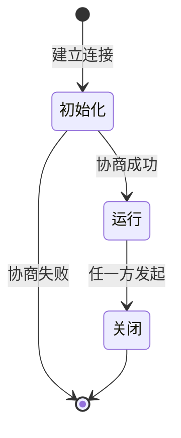
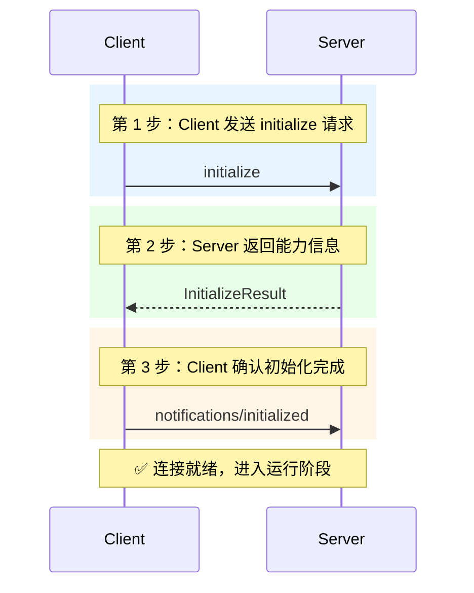
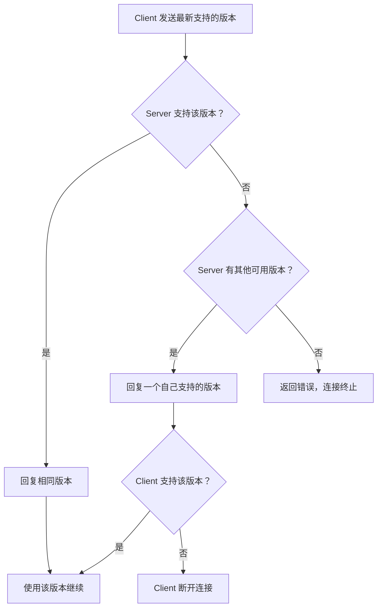
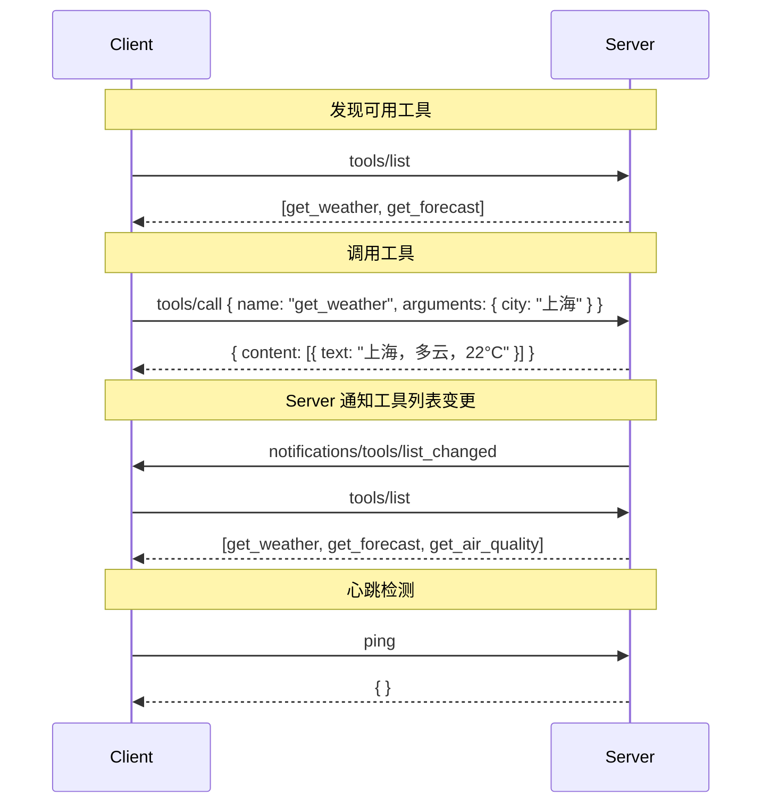
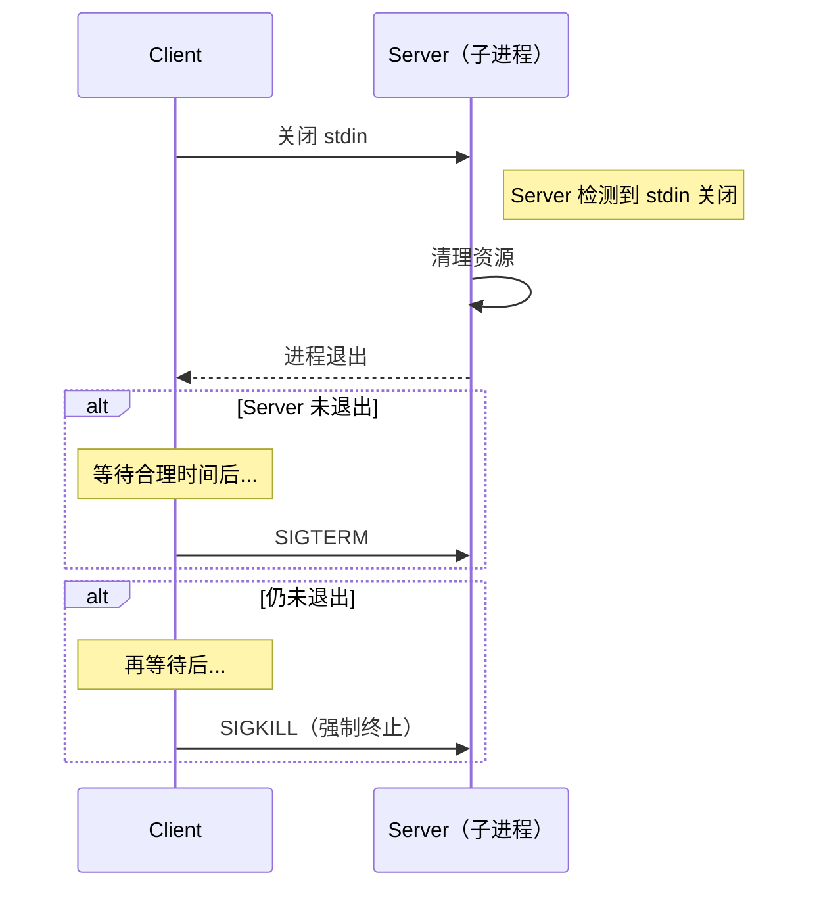
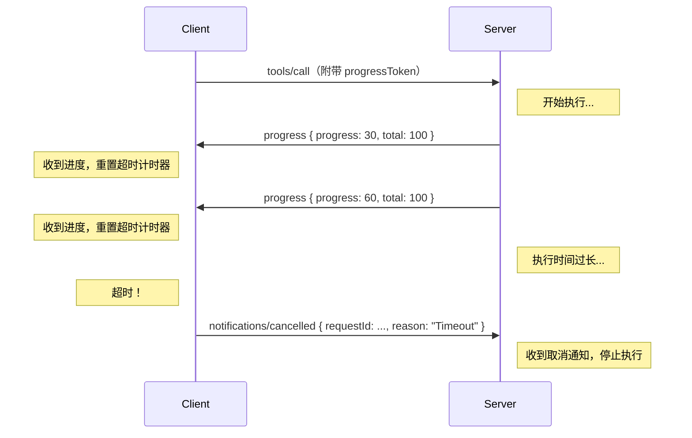
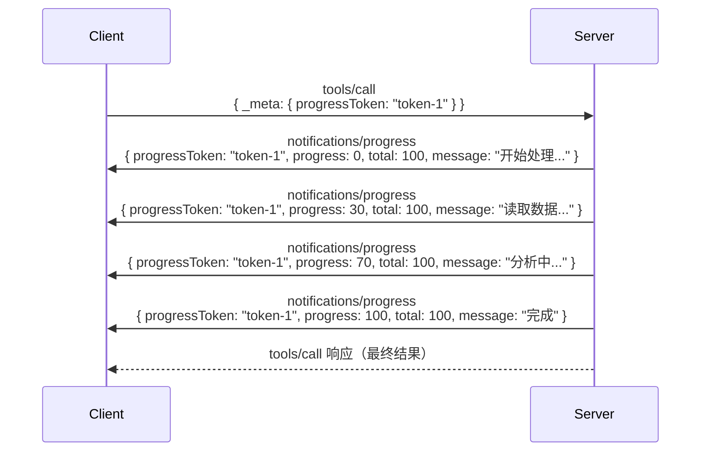

# ⏳ 03 — 协议生命周期

## 三个阶段

MCP 连接的生命周期分为三个阶段：**初始化**、**运行**、**关闭**。



这个设计和打电话很像——先拨号建立连接（初始化），然后通话（运行），最后挂断（关闭）。不同的是，MCP 在"拨号"阶段还要"商量好用什么语言交流"（能力协商）。

---

## 🤝 阶段一：初始化

初始化是 MCP 连接中最关键的环节，包含三步握手：



### 第 1 步：Client 发送 `initialize` 请求

```json
{
  "jsonrpc": "2.0",
  "id": 1,
  "method": "initialize",
  "params": {
    "protocolVersion": "2025-11-25",
    "capabilities": {
      "roots": { "listChanged": true },
      "sampling": {}
    },
    "clientInfo": {
      "name": "MyAIApp",
      "version": "1.0.0"
    }
  }
}
```

这条消息告诉 Server 三件事：

- **我支持的协议版本**：`2025-11-25`
- **我的能力**：支持 roots 查询（含列表变更通知）和 sampling
- **我是谁**：名称和版本号

### 第 2 步：Server 返回 `InitializeResult`

```json
{
  "jsonrpc": "2.0",
  "id": 1,
  "result": {
    "protocolVersion": "2025-11-25",
    "capabilities": {
      "tools": { "listChanged": true },
      "resources": { "subscribe": true, "listChanged": true },
      "logging": {}
    },
    "serverInfo": {
      "name": "WeatherServer",
      "version": "2.0.0"
    }
  }
}
```

Server 回应了：

- **协议版本**：我也支持 `2025-11-25`
- **我的能力**：提供 tools（支持列表变更通知）、resources（支持订阅和列表变更通知）、logging
- **我是谁**：天气服务，版本 2.0.0

### 第 3 步：Client 发送 `initialized` 通知

```json
{
  "jsonrpc": "2.0",
  "method": "notifications/initialized"
}
```

这是一个**通知**（Notification），不需要响应。它标志着初始化完成。

> ⚠️ **重要规则**：在 `initialized` 通知发送之前，Client 不能发送任何其他请求，Server 也不能发送除初始化响应之外的任何消息。

---

## 🔄 版本协商

MCP 使用**日期格式**的版本号（如 `2025-11-25`），而不是常见的语义化版本（如 `1.2.3`）。

### 为什么用日期版本？

语义化版本适合库和框架——你需要知道 `2.0` 和 `1.9` 之间有什么不兼容变更。但协议版本的核心需求是"双方是否能互通"，用日期更直观：

- `2025-11-25` 表示"这个版本的协议规范在 2025 年 11 月 25 日定稿"
- 只有在**不向后兼容**的变更时才递增版本

### 协商流程



### 版本状态

| 状态        | 含义                             | 可否用于生产 |
| ----------- | -------------------------------- | ------------ |
| **Draft**   | 起草中，随时可能变更             | ❌ 不推荐    |
| **Current** | 当前推荐版本，可能有向后兼容更新 | ✅ 推荐      |
| **Final**   | 最终版，不再变更                 | ✅ 可以      |

---

## ⚡ 阶段二：运行

初始化完成后进入运行阶段，双方可以自由交换消息，但必须遵守两个规则：

1. **只使用已协商的能力**：如果 Server 没有声明 `prompts` 能力，Client 不能发送 `prompts/list` 请求
2. **遵守协商的协议版本**：双方行为必须符合约定版本的规范

### 运行阶段的典型交互



---

## 🔚 阶段三：关闭

关闭过程因传输方式不同而有所区别：

### stdio 关闭流程



### HTTP 关闭流程

- Client 关闭所有 HTTP 连接和 SSE 流
- Client 可以发送 HTTP DELETE 请求主动终止会话
- Server 可以通过返回 HTTP 404 来表示会话已失效

---

## ⏱️ 超时与取消

### 超时机制

MCP 推荐（SHOULD）实现请求超时：



**关键设计细节**：

- 进度通知（progress）可以重置超时计时器——正在干活就不算超时
- 即使有进度通知，也应该有一个**最大超时时间**，防止任务无限执行
- 取消通知只是"请求取消"，不是"强制终止"——Server 可以选择忽略

### 取消机制

```json
{
  "jsonrpc": "2.0",
  "method": "notifications/cancelled",
  "params": {
    "requestId": "abc-123",
    "reason": "用户手动取消"
  }
}
```

注意事项：

- 取消是通知（Notification），不是请求——发送后不需要等待响应
- 收到取消时，Server 可能已经完成了执行——这是正常的竞态条件
- `initialize` 请求**不能被取消**

---

## 📊 进度追踪

对于耗时操作，MCP 提供了进度追踪机制。这个设计在用户体验上非常有价值——没人喜欢对着空白屏幕等待。

### 工作流程



### 进度通知的格式

```json
{
  "jsonrpc": "2.0",
  "method": "notifications/progress",
  "params": {
    "progressToken": "token-1",
    "progress": 50,
    "total": 100,
    "message": "正在处理第 5/10 个文件..."
  }
}
```

| 字段            | 必填 | 说明                         |
| --------------- | ---- | ---------------------------- |
| `progressToken` | ✅   | 与请求中的 token 对应        |
| `progress`      | ✅   | 当前进度值，**必须单调递增** |
| `total`         | ❌   | 总量（未知时可省略）         |
| `message`       | ❌   | 人类可读的进度描述           |

---

## 🏓 心跳（Ping）

MCP 提供了简单的 `ping` 机制来检测连接健康状态：

```json
// 请求
{ "jsonrpc": "2.0", "id": 1, "method": "ping" }

// 响应
{ "jsonrpc": "2.0", "id": 1, "result": {} }
```

这是一个双向的操作——Client 可以 ping Server，Server 也可以 ping Client。

---

## 🔒 初始化阶段的安全考量

初始化阶段有几个重要的安全设计：

1. **先协商，后通信**：在 `initialized` 通知之前不允许发送业务消息，防止未协商就通信
2. **能力声明是约束性的**：一旦协商完成，双方必须遵守声明的能力范围
3. **版本不兼容则断开**：不试图在不兼容的版本间"降级兼容"，避免安全漏洞

---

## 📌 小结

| 阶段     | 关键动作                 | 消息类型                          |
| -------- | ------------------------ | --------------------------------- |
| 初始化   | 版本协商 + 能力声明      | `initialize` / `initialized`      |
| 运行     | 工具调用、资源读取等业务 | 各种 request / response           |
| 关闭     | 清理资源、断开连接       | 取决于传输方式                    |
| 横切关注 | 超时、取消、进度、心跳   | `cancelled` / `progress` / `ping` |

---

> 📖 **下一章**：[消息格式与 JSON-RPC](./04-message-format.md) — 深入了解 MCP 消息的结构和规则。
