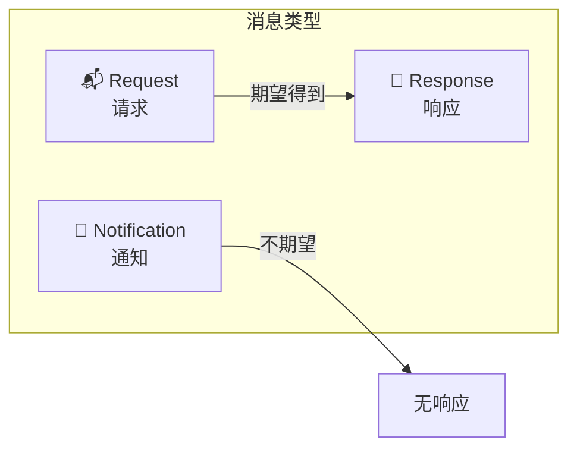
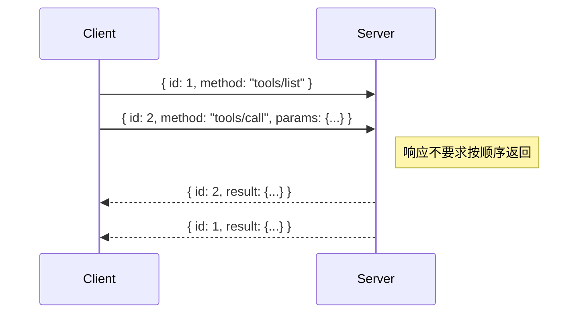

# 📨 04 — 消息格式与 JSON-RPC

## 为什么选择 JSON-RPC 2.0？

MCP 的所有通信都基于 **JSON-RPC 2.0** 协议。这个选择不是随意的：

| 候选方案     | 优点                   | 缺点                          | MCP 的选择理由               |
| ------------ | ---------------------- | ----------------------------- | ---------------------------- |
| REST         | 成熟、广泛使用         | 无状态，不适合双向通信        | MCP 需要有状态会话           |
| gRPC         | 高性能、强类型         | 需要 protobuf，工具链较重     | Server 要足够简单            |
| WebSocket    | 双向实时通信           | 没有标准化的请求/响应模式     | 需要明确的消息语义           |
| **JSON-RPC** | 轻量、支持双向请求/响应 | 性能不如二进制协议            | ✅ 简单、标准化、可读性好    |

JSON-RPC 让 MCP 实现了一个好的平衡：协议简单到任何语言都能轻松实现，同时有足够的结构支撑复杂交互。

---

## 📋 三种消息类型

MCP 中所有消息都属于以下三种类型之一：



### 1. Request（请求）

请求是"提问"——发送方期望收到回答。

```json
{
  "jsonrpc": "2.0",
  "id": "req-001",
  "method": "tools/call",
  "params": {
    "name": "get_weather",
    "arguments": {
      "city": "北京"
    },
    "_meta": {
      "progressToken": "progress-001"
    }
  }
}
```

**关键字段说明**：

| 字段       | 必填 | 说明                                       |
| ---------- | ---- | ------------------------------------------ |
| `jsonrpc`  | ✅   | 固定值 `"2.0"`                             |
| `id`       | ✅   | 请求标识符，用于匹配响应。**不能为 null**  |
| `method`   | ✅   | 调用的方法名                               |
| `params`   | ❌   | 方法参数，通常是一个对象                   |

**关于 `id` 的规则**：
- 类型可以是字符串或整数
- 在同一个会话内**必须唯一**
- **绝对不能是 null**（这是 MCP 对 JSON-RPC 的强化约束）

> 💡 为什么 `id` 不能为 null？因为 null 在 JSON-RPC 中表示"无法解析 id"，如果允许主动使用 null，就无法区分"故意用 null"还是"解析失败"。

### 2. Response（响应）

响应分为**成功**和**失败**两种：

**成功响应**：

```json
{
  "jsonrpc": "2.0",
  "id": "req-001",
  "result": {
    "content": [
      {
        "type": "text",
        "text": "北京，晴天，气温 25°C，空气质量良好"
      }
    ]
  }
}
```

**错误响应**：

```json
{
  "jsonrpc": "2.0",
  "id": "req-001",
  "error": {
    "code": -32602,
    "message": "Invalid params: unknown city 'Bejing'",
    "data": {
      "suggestion": "Did you mean 'Beijing'?"
    }
  }
}
```

**错误码规范**：

MCP 使用 JSON-RPC 标准错误码，并定义了协议特有的码：

| 错误码   | 含义                   | 使用场景                       |
| -------- | ---------------------- | ------------------------------ |
| `-32700` | Parse error            | 无法解析 JSON                  |
| `-32600` | Invalid Request        | JSON-RPC 结构不合法            |
| `-32601` | Method not found       | 调用了未知方法                 |
| `-32602` | Invalid params         | 参数错误                       |
| `-32603` | Internal error         | 服务器内部错误                 |
| `-32002` | Resource not found     | 请求的资源不存在（MCP 定义）   |

### 3. Notification（通知）

通知是"广播"——发出去就完了，不需要回复。

```json
{
  "jsonrpc": "2.0",
  "method": "notifications/tools/list_changed"
}
```

**注意**：通知**没有 `id` 字段**。这是区分通知和请求的关键标志。

---

## 📦 `_meta` 元数据

MCP 在 JSON-RPC 的基础上增加了 `_meta` 字段，用于携带协议级别的元数据。

```json
{
  "jsonrpc": "2.0",
  "id": 1,
  "method": "tools/call",
  "params": {
    "name": "search",
    "arguments": { "query": "MCP protocol" },
    "_meta": {
      "progressToken": "abc-123",
      "io.modelcontextprotocol/requestId": "trace-456"
    }
  }
}
```

### 命名规则

`_meta` 中的 key 遵循 `{prefix}/{name}` 格式：

| 前缀类型                 | 示例                                 | 含义         |
| ------------------------ | ------------------------------------ | ------------ |
| 无前缀                   | `progressToken`                      | 协议内置字段 |
| `io.modelcontextprotocol` | `io.modelcontextprotocol/requestId` | MCP 官方保留 |
| 反向域名                 | `com.example/traceId`               | 第三方扩展   |

这种设计借鉴了 Java 的包命名规范和 HTTP Header 的命名传统，避免不同扩展之间的命名冲突。

---

## 📐 JSON Schema 支持

MCP 使用 JSON Schema 来定义工具输入、资源结构等数据格式。

### 默认方言

当 JSON Schema 中没有 `$schema` 字段时，MCP 默认使用 **JSON Schema 2020-12**（即 `draft/2020-12`）。

```json
{
  "type": "object",
  "properties": {
    "city": {
      "type": "string",
      "description": "城市名称"
    },
    "unit": {
      "type": "string",
      "enum": ["celsius", "fahrenheit"],
      "default": "celsius"
    }
  },
  "required": ["city"]
}
```

### 显式指定方言

如果需要使用其他方言，可以通过 `$schema` 字段声明：

```json
{
  "$schema": "https://json-schema.org/draft/2020-12/schema",
  "type": "object",
  "properties": {
    "city": { "type": "string" }
  }
}
```

**实现要求**：
- **必须**（MUST）支持 JSON Schema 2020-12
- **应该**（SHOULD）在文档中说明支持的其他方言

---

## 🏷️ Icons 图标支持

MCP 为 Tools、Resources、Prompts 和 Server 实现提供了标准化的图标支持：

```json
{
  "name": "get_weather",
  "icons": [
    {
      "uri": "https://example.com/weather-icon.png",
      "mediaType": "image/png"
    },
    {
      "uri": "data:image/svg+xml;base64,PHN2Zy...",
      "mediaType": "image/svg+xml"
    }
  ]
}
```

**安全约束**：
- URI 只能使用 `https://` 或 `data:` 协议
- 不允许使用 `http://`、`file://`、`javascript:` 等不安全协议
- 获取图标时**不能携带认证信息**
- SVG 内容必须经过安全清洗（防止 XSS）

---

## 🔀 请求/响应对应关系

每一个 Request 都期望得到恰好一个 Response，通过 `id` 字段匹配：



**关键规则**：
- 响应**不要求**按请求顺序返回——这允许 Server 先返回快速完成的请求
- 一个 Request 只能有**一个** Response（成功或失败）
- Notification 不会收到任何 Response

---

## 🧮 完整消息类型速查

下表列出了 MCP 协议中的主要消息方法：

### Client → Server

| 方法                        | 类型    | 用途                 |
| --------------------------- | ------- | -------------------- |
| `initialize`                | Request | 初始化连接           |
| `notifications/initialized` | Notice  | 确认初始化完成       |
| `ping`                      | Request | 心跳检测             |
| `tools/list`                | Request | 列出可用工具         |
| `tools/call`                | Request | 调用工具             |
| `resources/list`            | Request | 列出可用资源         |
| `resources/read`            | Request | 读取资源内容         |
| `resources/subscribe`       | Request | 订阅资源变更         |
| `resources/unsubscribe`     | Request | 取消订阅             |
| `prompts/list`              | Request | 列出可用提示词模板   |
| `prompts/get`               | Request | 获取提示词内容       |
| `completion/complete`       | Request | 参数自动补全         |
| `notifications/cancelled`   | Notice  | 取消进行中的请求     |

### Server → Client

| 方法                                    | 类型    | 用途                     |
| --------------------------------------- | ------- | ------------------------ |
| `ping`                                  | Request | 心跳检测                 |
| `sampling/createMessage`                | Request | 请求 AI 生成             |
| `roots/list`                            | Request | 查询可访问的文件系统根   |
| `elicitation/create`                    | Request | 请求用户输入             |
| `notifications/tools/list_changed`      | Notice  | 工具列表变更通知         |
| `notifications/resources/list_changed`  | Notice  | 资源列表变更通知         |
| `notifications/resources/updated`       | Notice  | 单个资源更新通知         |
| `notifications/prompts/list_changed`    | Notice  | 提示词列表变更通知       |
| `notifications/progress`                | Notice  | 进度更新                 |
| `notifications/logging`                 | Notice  | 日志消息                 |

---

## 📌 小结

| 概念           | 要点                                                 |
| -------------- | ---------------------------------------------------- |
| 基础协议       | JSON-RPC 2.0，UTF-8 编码                             |
| 消息类型       | Request（需要回复）、Notification（不需要）、Response |
| 请求 ID        | 字符串或整数，不能为 null，会话内唯一                |
| 元数据         | `_meta` 字段，支持扩展前缀                           |
| Schema         | 默认 JSON Schema 2020-12                             |
| 错误处理       | 标准 JSON-RPC 错误码 + MCP 自定义码                  |

---

> 📖 **下一章**：[传输机制详解](./05-transport.md) — 了解 MCP 消息如何在 Client 和 Server 之间传递。
