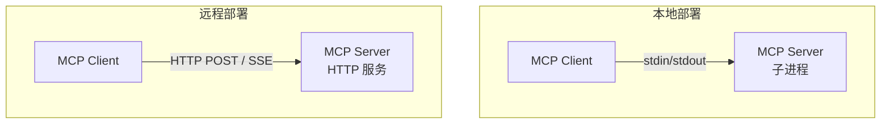
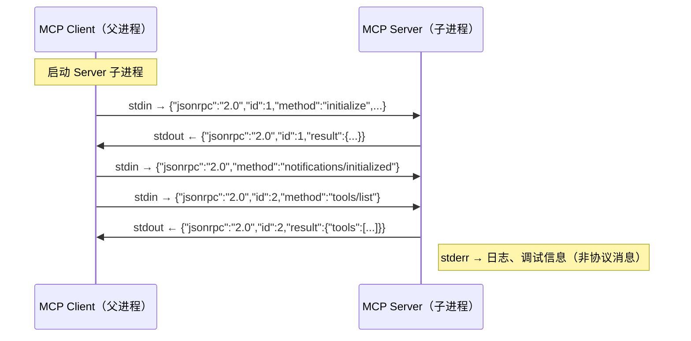
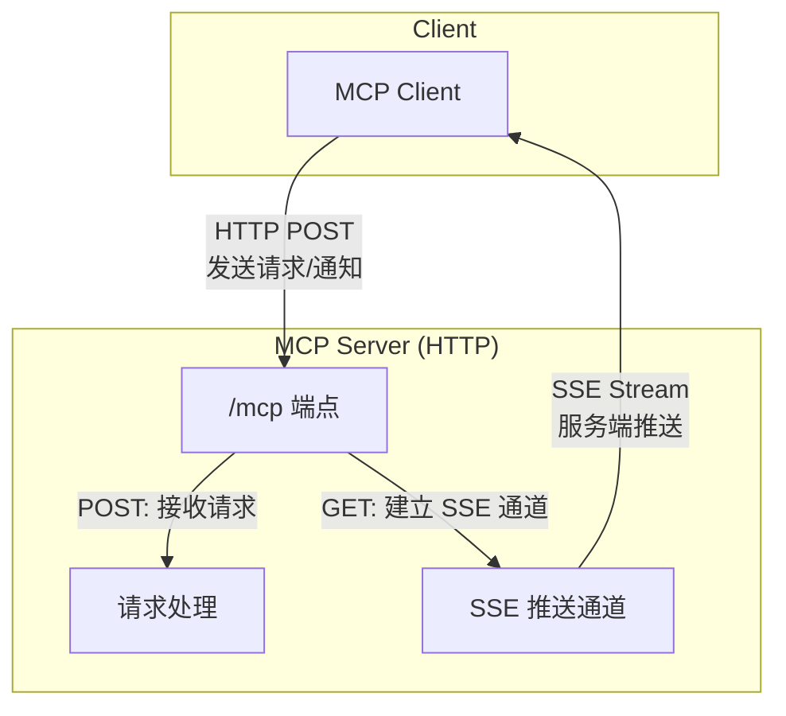
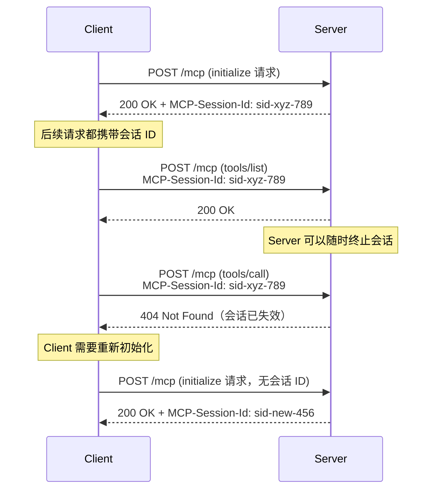
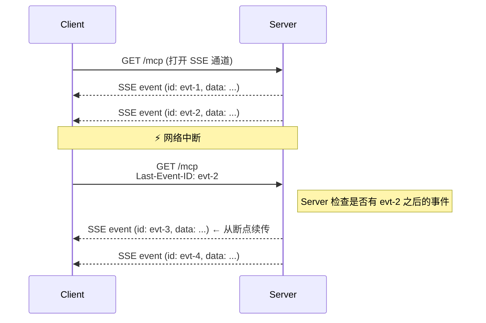
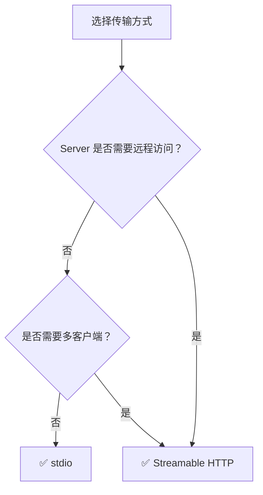

# 🚛 05 — 传输机制详解

## 传输层的职责

传输层回答一个核心问题：**JSON-RPC 消息怎么从 Client 到达 Server、再回来？**

MCP 定义了两种传输方式，覆盖本地和远程两种典型部署场景：



---

## 📟 stdio 传输

### 工作原理

stdio 是最简单的传输方式：Client 以**子进程**的方式启动 Server，通过标准输入/输出进行通信。



### 三条通道的分工

| 通道     | 方向            | 用途                        | 注意事项                       |
| -------- | --------------- | --------------------------- | ------------------------------ |
| `stdin`  | Client → Server | 发送 JSON-RPC 消息          | 关闭 stdin 触发 Server 关闭    |
| `stdout` | Server → Client | 返回 JSON-RPC 消息          | **只能**输出合法的 MCP 消息    |
| `stderr` | Server → Client | 日志和调试信息              | Client 可以忽略或记录          |

### 消息格式规则

```
{"jsonrpc":"2.0","id":1,"method":"tools/list"}\n
{"jsonrpc":"2.0","id":2,"method":"tools/call","params":{...}}\n
```

- 每条消息占**一行**，以换行符 `\n` 分隔
- 消息内部**不能包含换行符**（JSON 中的换行必须转义为 `\n`）
- 编码必须是 **UTF-8**

### 为什么 stdout 只能输出 MCP 消息？

这是一个容易踩的坑。假设你的 Server 用 Python 写的，代码中有一行 `print("debug info")`——这条 debug 信息会被 Client 当作 MCP 消息解析，然后报错。

```python
# ❌ 错误写法
print("Server started")  # 这会污染 stdout！

# ✅ 正确写法
import sys
print("Server started", file=sys.stderr)  # 日志写到 stderr
```

### 关闭流程

```
1. Client 关闭 stdin
2. Server 检测到 stdin 关闭，清理资源后退出
3. Client 等待 Server 进程退出（合理超时）
4. 如果超时未退出 → 发送 SIGTERM
5. 如果仍未退出 → 发送 SIGKILL（强制终止）
```

### 适用场景

✅ IDE 中的本地工具（VS Code 扩展启动本地 MCP Server）
✅ 命令行工具集成
✅ 开发调试阶段

❌ 不适合远程部署
❌ 不支持多客户端同时连接

---

## 🌐 Streamable HTTP 传输

### 工作原理

Streamable HTTP 让 MCP Server 作为一个独立的 HTTP 服务运行，支持远程访问和多客户端并发。

这个传输方式比 stdio 复杂得多，因为它要解决网络通信带来的一系列问题：连接管理、会话保持、断线重连、认证授权等。

### 整体通信模型



### 发送消息到 Server：HTTP POST

Client 通过 HTTP POST 向 Server 发送消息：

```http
POST /mcp HTTP/1.1
Content-Type: application/json
Accept: application/json, text/event-stream
MCP-Session-Id: session-abc-123

{
  "jsonrpc": "2.0",
  "id": 1,
  "method": "tools/call",
  "params": {
    "name": "get_weather",
    "arguments": { "city": "上海" }
  }
}
```

Server 的响应有两种模式：

**模式 A：直接 JSON 响应**（适合快速请求）

```http
HTTP/1.1 200 OK
Content-Type: application/json

{
  "jsonrpc": "2.0",
  "id": 1,
  "result": { "content": [{ "type": "text", "text": "上海，晴，28°C" }] }
}
```

**模式 B：SSE 流式响应**（适合耗时操作）

```http
HTTP/1.1 200 OK
Content-Type: text/event-stream

id: evt-001
data: {"jsonrpc":"2.0","method":"notifications/progress","params":{"progressToken":"p1","progress":30,"total":100}}

id: evt-002
data: {"jsonrpc":"2.0","method":"notifications/progress","params":{"progressToken":"p1","progress":100,"total":100}}

id: evt-003
data: {"jsonrpc":"2.0","id":1,"result":{"content":[{"type":"text","text":"处理完成"}]}}
```

Server 选择哪种模式由自己决定。Client 通过 `Accept` 头表明两种都接受。

### 接收 Server 推送：HTTP GET

有些场景下 Server 需要主动推送消息给 Client（比如资源变更通知）。Client 通过 HTTP GET 打开一个 SSE 通道：

```http
GET /mcp HTTP/1.1
Accept: text/event-stream
MCP-Session-Id: session-abc-123
```

```http
HTTP/1.1 200 OK
Content-Type: text/event-stream

id: evt-100
data: {"jsonrpc":"2.0","method":"notifications/resources/updated","params":{"uri":"file:///data.json"}}

id: evt-101
data: {"jsonrpc":"2.0","method":"notifications/tools/list_changed"}
```

> 📌 如果 Server 不支持 SSE 推送，可以对 GET 请求返回 `405 Method Not Allowed`。

### 会话管理

Streamable HTTP 引入了会话（Session）概念来跟踪客户端状态：



**会话 ID 要求**：
- 必须是全局唯一的、加密安全的（UUID 或 JWT 格式）
- Client 必须在后续所有请求中携带
- Server 可以随时终止会话（返回 404）

### 断线重连与消息重传

网络不稳定是分布式系统的常态，MCP 提供了消息重传机制：



**机制**：
- Server 为每个 SSE 事件分配唯一 ID
- Client 重连时通过 `Last-Event-ID` 头告知最后收到的事件
- Server 从断点位置重新发送后续事件

---

## ⚖️ 两种传输方式对比

| 特性             | stdio                  | Streamable HTTP              |
| ---------------- | ---------------------- | ---------------------------- |
| 部署方式         | 子进程                 | 独立 HTTP 服务               |
| 并发客户端       | 1 个                   | 多个                         |
| 网络需求         | 无                     | 需要                         |
| 认证支持         | 不需要（进程隔离）     | OAuth 2.1 等                 |
| 断线重连         | 不适用                 | 支持（SSE + Last-Event-ID）  |
| 会话管理         | 隐式（进程生命周期）   | 显式（Session ID）           |
| 安全考量         | 进程级隔离             | Origin 校验、HTTPS、认证     |
| 实现复杂度       | 低                     | 高                           |
| 性能             | 低延迟（本地进程间通信）| 取决于网络                  |

### 选型建议



---

## 🔐 HTTP 传输的安全要求

Streamable HTTP 暴露在网络中，需要额外的安全措施：

### 1. Origin 头校验（防止 DNS 重绑定攻击）

```
// 请求
GET /mcp HTTP/1.1
Origin: https://evil-site.com

// Server 校验：Origin 不在白名单中
HTTP/1.1 403 Forbidden
```

**什么是 DNS 重绑定攻击？**

假设你在本机 `127.0.0.1:3000` 运行了一个 MCP Server。攻击者让你访问一个恶意网页，该网页的域名先解析为攻击者的 IP，然后迅速切换为 `127.0.0.1`。浏览器认为这是"同一个域"，恶意脚本就能访问你本地的 MCP Server——这就是 DNS 重绑定。

校验 `Origin` 头可以识别并拒绝来自非预期来源的请求。

### 2. 本地绑定

当 Server 在本地运行时，**必须**绑定到 `127.0.0.1`（不是 `0.0.0.0`），防止局域网内其他设备访问。

### 3. 认证

远程 Server 必须实现认证机制（详见 [安全机制与授权](./10-security.md)）。

---

## 🧪 实际运行示例

### stdio 示例：本地文件系统 Server

配置文件（Claude Desktop）：

```json
{
  "mcpServers": {
    "filesystem": {
      "command": "npx",
      "args": [
        "-y",
        "@modelcontextprotocol/server-filesystem",
        "/Users/username/Documents"
      ]
    }
  }
}
```

运行时消息流（stdin/stdout）：

```
→ stdin:  {"jsonrpc":"2.0","id":1,"method":"initialize","params":{...}}
← stdout: {"jsonrpc":"2.0","id":1,"result":{"capabilities":{"tools":{},"resources":{}},...}}
→ stdin:  {"jsonrpc":"2.0","method":"notifications/initialized"}
→ stdin:  {"jsonrpc":"2.0","id":2,"method":"tools/list"}
← stdout: {"jsonrpc":"2.0","id":2,"result":{"tools":[{"name":"read_file",...},{"name":"write_file",...}]}}
```

### Streamable HTTP 示例：远程天气 Server

```
→ POST /mcp
  Content-Type: application/json
  Accept: application/json, text/event-stream
  Body: {"jsonrpc":"2.0","id":1,"method":"initialize","params":{...}}

← 200 OK
  Content-Type: application/json
  MCP-Session-Id: sess-a1b2c3
  Body: {"jsonrpc":"2.0","id":1,"result":{"capabilities":{"tools":{}},...}}

→ POST /mcp
  MCP-Session-Id: sess-a1b2c3
  Body: {"jsonrpc":"2.0","method":"notifications/initialized"}

← 202 Accepted

→ POST /mcp
  MCP-Session-Id: sess-a1b2c3
  Body: {"jsonrpc":"2.0","id":2,"method":"tools/call","params":{"name":"get_weather",...}}

← 200 OK
  Content-Type: text/event-stream
  id: e1
  data: {"jsonrpc":"2.0","method":"notifications/progress","params":{"progressToken":"p1","progress":50,"total":100}}

  id: e2
  data: {"jsonrpc":"2.0","id":2,"result":{"content":[{"type":"text","text":"上海 28°C 晴"}]}}
```

---

## 📌 小结

| 概念              | 要点                                           |
| ----------------- | ---------------------------------------------- |
| stdio 传输        | 子进程方式，stdin/stdout 通信，简单本地场景     |
| Streamable HTTP   | HTTP POST + SSE，支持远程和多客户端             |
| 消息分隔          | stdio 用换行符，HTTP 用标准 HTTP 响应           |
| 会话管理          | HTTP 通过 `MCP-Session-Id` 头维护               |
| 断线重连          | HTTP 通过 SSE `Last-Event-ID` 实现              |
| 安全              | HTTP 必须校验 Origin、绑定 localhost、实现认证   |

---

> 📖 **下一章**：[服务端能力 — 工具（Tools）](./06-server-tools.md) — 学习 MCP 中最常用的工具能力。
