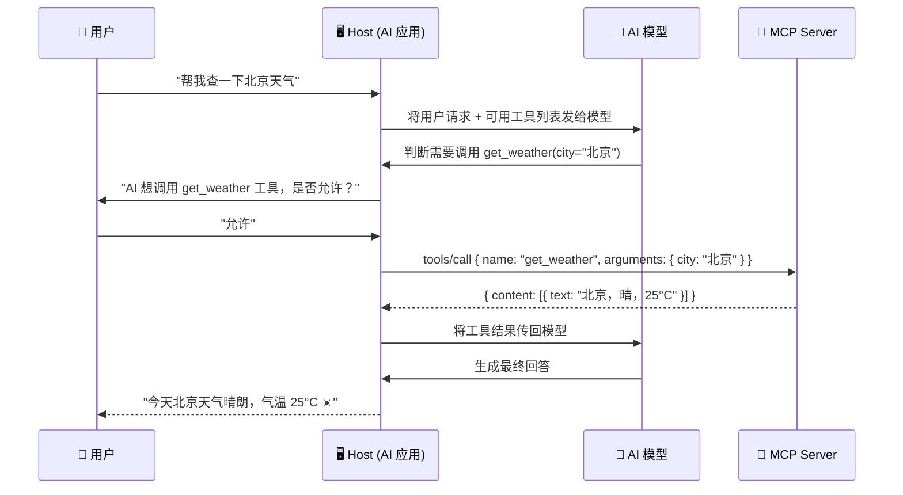
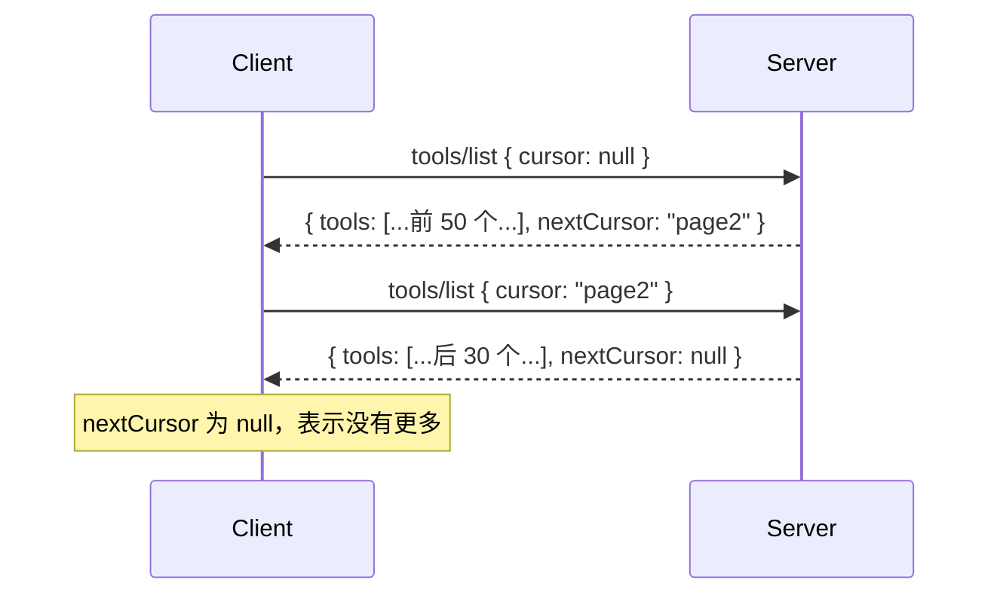
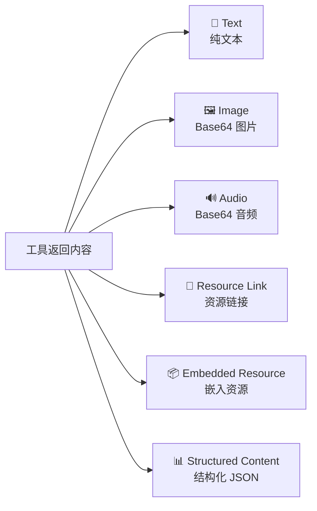

# 🔧 06 — 服务端能力 — 工具（Tools）

## 什么是 Tool？

Tool 是 MCP Server 暴露给 AI 模型的**可执行函数**。它是三种核心原语中最常用的——让 AI 不仅能"说"，还能"做"。

用一个生活比喻来理解：

> 如果 AI 是一个在办公室工作的人，那么 Tool 就是桌上的电话、电脑、打印机——他可以根据需要主动使用这些工具来完成任务。

### Tool 的控制模型

Tool 由**模型控制**——AI 根据上下文自主判断何时调用哪个工具。但这不意味着完全自动化，MCP 要求在 AI 调用工具之前需要**人类确认**。



---

## 📋 工具的定义结构

一个完整的 Tool 定义包含以下字段：

```json
{
  "name": "get_weather",
  "title": "天气查询",
  "description": "获取指定城市的当前天气信息，包括温度、湿度、风力等",
  "inputSchema": {
    "type": "object",
    "properties": {
      "city": {
        "type": "string",
        "description": "城市名称，如'北京'、'上海'"
      },
      "unit": {
        "type": "string",
        "enum": ["celsius", "fahrenheit"],
        "description": "温度单位",
        "default": "celsius"
      }
    },
    "required": ["city"]
  },
  "outputSchema": {
    "type": "object",
    "properties": {
      "temperature": { "type": "number" },
      "humidity": { "type": "number" },
      "description": { "type": "string" }
    }
  },
  "annotations": {
    "title": "Weather Lookup",
    "readOnlyHint": true,
    "openWorldHint": true
  }
}
```

### 字段详解

| 字段            | 必填 | 说明                                                   |
| --------------- | ---- | ------------------------------------------------------ |
| `name`          | ✅   | 唯一标识符，1-128 字符，只允许字母、数字、下划线、连字符、点 |
| `title`         | ❌   | 人类可读的显示名称                                     |
| `description`   | ❌   | 详细描述，帮助 AI 理解何时使用此工具                   |
| `inputSchema`   | ❌   | JSON Schema，定义输入参数的结构和约束                  |
| `outputSchema`  | ❌   | JSON Schema，定义输出的结构                            |
| `annotations`   | ❌   | 行为元数据（是否只读、是否涉及外部世界等）             |
| `icons`         | ❌   | 工具图标，用于 UI 展示                                 |

### annotations 行为注解

annotations 告诉 Client 这个工具的行为特征，帮助做安全决策：

| 注解              | 类型    | 含义                                 | 示例                     |
| ----------------- | ------- | ------------------------------------ | ------------------------ |
| `readOnlyHint`    | boolean | 是否只读（不会修改状态）             | 查询天气 → `true`        |
| `destructiveHint` | boolean | 是否有破坏性（删除/覆盖数据）       | 删除文件 → `true`        |
| `idempotentHint`  | boolean | 是否幂等（重复调用结果一样）         | 查询 API → `true`        |
| `openWorldHint`   | boolean | 是否与外部世界交互（网络、第三方 API）| 调用天气 API → `true`   |

> 💡 这些都是 Hint（提示），不是强制约束。Client 可以基于这些提示决定是否需要用户确认——比如 `destructiveHint: true` 的工具可能需要二次确认。

---

## 🔍 工具发现：`tools/list`

Client 在初始化完成后，通过 `tools/list` 发现 Server 提供的工具：

```json
// 请求
{
  "jsonrpc": "2.0",
  "id": 1,
  "method": "tools/list",
  "params": {
    "cursor": null
  }
}

// 响应
{
  "jsonrpc": "2.0",
  "id": 1,
  "result": {
    "tools": [
      {
        "name": "get_weather",
        "title": "天气查询",
        "description": "获取指定城市的天气信息",
        "inputSchema": {
          "type": "object",
          "properties": {
            "city": { "type": "string", "description": "城市名称" }
          },
          "required": ["city"]
        }
      },
      {
        "name": "get_forecast",
        "title": "天气预报",
        "description": "获取指定位置未来几天的天气预报",
        "inputSchema": {
          "type": "object",
          "properties": {
            "latitude": { "type": "number" },
            "longitude": { "type": "number" }
          },
          "required": ["latitude", "longitude"]
        }
      }
    ],
    "nextCursor": null
  }
}
```

### 分页机制

当工具列表很大时，使用游标分页：



### 工具列表变更

如果 Server 声明了 `tools.listChanged` 能力，当工具列表发生变化时会主动通知 Client：

```json
// Server → Client
{
  "jsonrpc": "2.0",
  "method": "notifications/tools/list_changed"
}
```

Client 收到通知后应重新调用 `tools/list` 获取最新列表。

> 📌 **确定性排序**：Server 应该（SHOULD）保持工具列表的顺序一致。为什么？因为 AI 模型在处理工具列表时会使用 prompt 缓存，稳定的顺序能提升缓存命中率。

---

## ⚡ 工具调用：`tools/call`

```json
// 请求
{
  "jsonrpc": "2.0",
  "id": 2,
  "method": "tools/call",
  "params": {
    "name": "get_weather",
    "arguments": {
      "city": "上海"
    },
    "_meta": {
      "progressToken": "weather-progress-1"
    }
  }
}

// 成功响应
{
  "jsonrpc": "2.0",
  "id": 2,
  "result": {
    "content": [
      {
        "type": "text",
        "text": "上海当前天气：多云，气温 22°C，湿度 75%，东南风 3 级"
      }
    ]
  }
}
```

### 工具返回内容类型

工具可以返回多种类型的内容：



**文本内容**：

```json
{
  "type": "text",
  "text": "查询结果：..."
}
```

**图片内容**：

```json
{
  "type": "image",
  "data": "iVBORw0KGgo...",
  "mimeType": "image/png"
}
```

**结构化内容**（带 Schema 校验）：

```json
{
  "type": "content",
  "content": {
    "temperature": 22,
    "humidity": 75,
    "wind": "东南风 3 级"
  }
}
```

---

## ❌ 错误处理

工具调用的错误分为两个层面：

### 协议层错误（JSON-RPC Error）

请求本身有问题（工具不存在、参数格式错误等）：

```json
{
  "jsonrpc": "2.0",
  "id": 2,
  "error": {
    "code": -32602,
    "message": "Unknown tool: get_wether"
  }
}
```

### 业务层错误（Tool Execution Error）

工具执行了，但结果是一个错误（API 调用失败、业务逻辑错误等）：

```json
{
  "jsonrpc": "2.0",
  "id": 2,
  "result": {
    "content": [
      {
        "type": "text",
        "text": "无法获取天气信息：该城市不在支持的区域内"
      }
    ],
    "isError": true
  }
}
```

**两者的区别**：

| 维度     | 协议层错误           | 业务层错误                 |
| -------- | -------------------- | -------------------------- |
| 位置     | `error` 字段         | `result` 中 `isError: true` |
| 含义     | 请求本身有问题       | 请求合法，执行中出错       |
| AI 处理  | 通常不传递给 AI 模型 | 传递给 AI，AI 可以据此调整 |

这种区分很有价值：业务错误是"有意义的信息"，AI 可以根据错误内容调整策略（比如换个城市查询）；而协议错误意味着代码有 bug，需要开发者修复。

---

## 🔒 安全最佳实践

### Server 端

```
✅ 验证所有输入参数（类型、范围、格式）
✅ 实现访问控制（谁可以调用什么工具）
✅ 对外部 API 调用做速率限制
✅ 清洗输出内容（避免注入攻击）
✅ 对敏感操作记录审计日志
```

### Client 端

```
✅ 敏感操作前要求用户确认
✅ 在调用前展示工具名称和输入参数
✅ 对工具调用实施超时
✅ 验证返回结果的合法性
✅ 记录工具调用日志
```

### 信任模型

⚠️ **关键安全原则**：工具描述（description）应被视为**不可信**内容。

原因：MCP Server 可以是任何第三方开发的程序。恶意 Server 可能通过精心构造的 description 来误导 AI 模型执行不当操作（类似于 prompt injection）。

Host 应该：
- 清晰地向用户展示已连接的 Server 和可用工具
- 在工具调用前提供视觉指示
- 允许用户禁用或限制特定工具

---

## 💻 实现示例

### Python Server（使用 FastMCP）

```python
from mcp.server.fastmcp import FastMCP

# 创建 Server 实例
mcp = FastMCP("weather-server")

@mcp.tool()
async def get_weather(city: str) -> str:
    """获取指定城市的当前天气信息。

    Args:
        city: 城市名称，如"北京"、"上海"
    """
    # 实际应用中这里会调用天气 API
    weather_data = {
        "北京": "晴，25°C，湿度 40%",
        "上海": "多云，22°C，湿度 75%",
        "广州": "阵雨，28°C，湿度 85%",
    }
    if city in weather_data:
        return f"{city}天气：{weather_data[city]}"
    return f"暂不支持查询{city}的天气"

@mcp.tool()
async def get_forecast(latitude: float, longitude: float) -> str:
    """获取指定坐标位置的天气预报。

    Args:
        latitude: 纬度，如 39.9042
        longitude: 经度，如 116.4074
    """
    return f"坐标({latitude}, {longitude})未来3天：晴→多云→小雨"

# 启动 Server
if __name__ == "__main__":
    mcp.run(transport="stdio")
```

**FastMCP 的巧妙之处**：通过 Python 类型注解（type hints）和 docstring 自动生成 `inputSchema` 和 `description`，大大简化了 Tool 的定义。

### TypeScript Server

```typescript
import { McpServer } from "@modelcontextprotocol/sdk/server/mcp.js";
import { StdioServerTransport } from "@modelcontextprotocol/sdk/server/stdio.js";
import { z } from "zod";

const server = new McpServer({
  name: "weather-server",
  version: "1.0.0",
});

// 使用 Zod schema 定义工具
server.tool(
  "get_weather",
  "获取指定城市的天气信息",
  {
    city: z.string().describe("城市名称"),
    unit: z.enum(["celsius", "fahrenheit"]).default("celsius").describe("温度单位"),
  },
  async ({ city, unit }) => {
    // 调用天气 API...
    return {
      content: [
        { type: "text", text: `${city}: 晴天，25°C` },
      ],
    };
  }
);

// 启动 stdio 传输
const transport = new StdioServerTransport();
await server.connect(transport);
```

---

## 📌 小结

| 概念             | 要点                                           |
| ---------------- | ---------------------------------------------- |
| Tool 定位        | AI 可调用的函数，模型自主决定调用时机          |
| 关键协议方法     | `tools/list`（发现）、`tools/call`（调用）     |
| 输入校验         | 通过 JSON Schema（inputSchema）约束           |
| 输出类型         | 文本、图片、音频、资源链接、结构化 JSON        |
| 错误处理         | 协议层（error）vs 业务层（isError）            |
| 安全核心         | 工具描述不可信，执行前需人类确认               |
| 列表管理         | 支持分页、变更通知、确定性排序                 |

---

> 📖 **下一章**：[服务端能力 — 资源（Resources）](./07-server-resources.md) — 学习如何通过资源向 AI 提供上下文数据。
