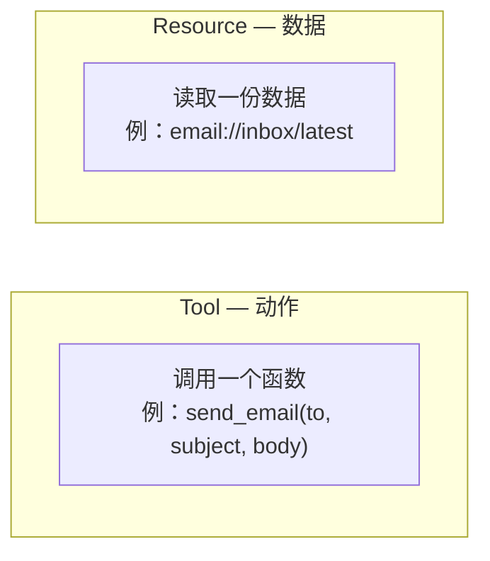
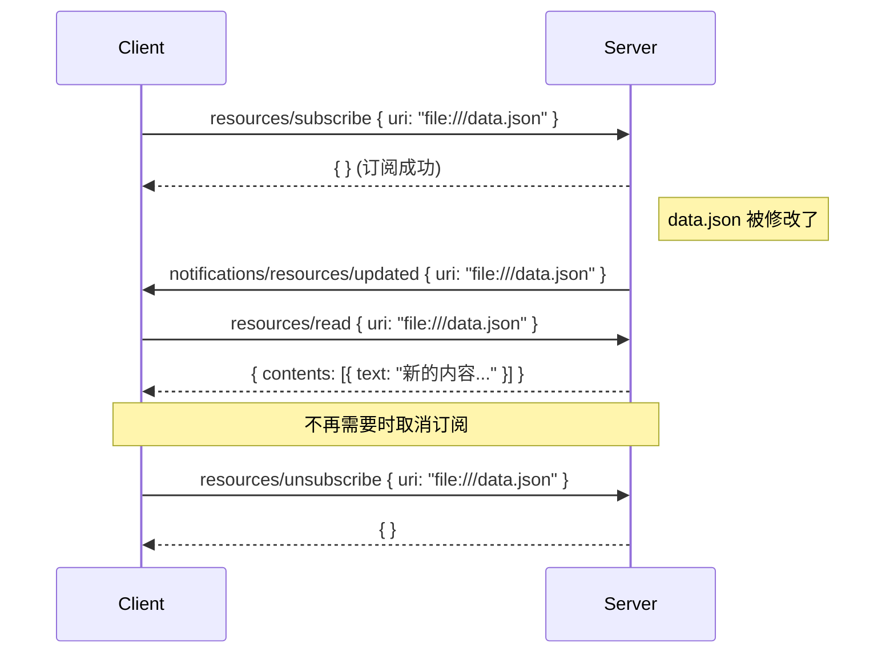
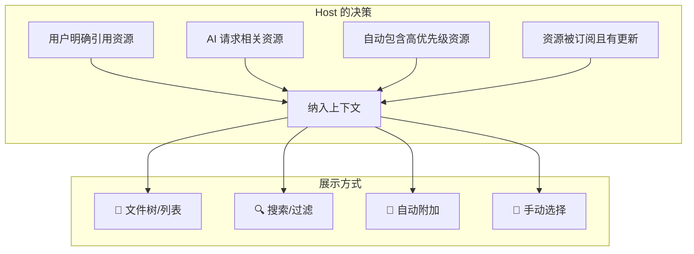

# 📄 07 — 服务端能力 — 资源（Resources）

## 什么是 Resource？

Resource（资源）是 MCP Server 暴露给 Client 的**只读数据**。它代表 Server 能提供的上下文信息——文件内容、数据库记录、配置信息、日志等。

### Resource 与 Tool 的本质区别



| 维度   | Tool（工具）           | Resource（资源）      |
| ------ | ---------------------- | --------------------- |
| 性质   | 函数调用               | 数据读取              |
| 控制方 | AI 模型决定何时调用    | Host 应用决定何时读取 |
| 副作用 | 可能有（写入、发送等） | 无（只读）            |
| 类比   | API 接口               | 数据库视图 / 文件共享 |

**为什么要区分？**

如果把读取数据也设计成 Tool，每次读取都需要 AI 判断 + 用户确认——这对于频繁读取的场景太麻烦了。Resource 由应用控制，可以自动纳入上下文，不需要每次都让用户确认。

---

## 🆔 资源的标识：URI

每个 Resource 通过 **URI（统一资源标识符）** 唯一标识，遵循 RFC 3986 规范。

```
file:///Users/alice/projects/myapp/config.json
https://api.example.com/docs/getting-started
git://repo/main/src/index.ts
postgres://localhost/mydb/users
custom://weather/current/beijing
```

### 常见 URI 方案

| 方案       | 用途         | 示例                                |
| ---------- | ------------ | ----------------------------------- |
| `file://`  | 本地文件系统 | `file:///etc/nginx/nginx.conf`      |
| `https://` | Web 资源     | `https://docs.example.com/api.html` |
| `git://`   | 版本控制系统 | `git://repo/main/README.md`         |
| 自定义方案 | 应用特定数据 | `calendar://events/2024-12-25`      |

Server 也可以使用自定义 URI 方案，这给了开发者很大的灵活性。

---

## 📝 资源定义

### 直接资源（Direct Resource）

直接资源有固定的 URI，指向特定数据：

```json
{
  "uri": "file:///project/config.json",
  "name": "config.json",
  "title": "项目配置文件",
  "description": "应用程序的主要配置文件，包含数据库连接、API 密钥等设置",
  "mimeType": "application/json",
  "annotations": {
    "audience": ["user", "assistant"],
    "priority": 0.8,
    "lastModified": "2025-01-15T10:30:00Z"
  }
}
```

### 资源模板（Resource Template）

资源模板使用 URI 模板（RFC 6570），支持参数化资源：

```json
{
  "uriTemplate": "weather://forecast/{city}/{days}",
  "name": "天气预报",
  "description": "获取指定城市未来 N 天的天气预报",
  "mimeType": "application/json"
}
```

模板中的 `{city}` 和 `{days}` 是参数，Client 在请求时提供具体值：

```
weather://forecast/beijing/7     → 北京未来 7 天天气
weather://forecast/shanghai/3    → 上海未来 3 天天气
```

**模板 vs 直接资源**：

| 类型     | URI 固定？   | 适用场景             |
| -------- | ------------ | -------------------- |
| 直接资源 | 是           | 配置文件、固定数据集 |
| 资源模板 | 否（参数化） | 动态查询、按条件获取 |

---

## 🔍 资源发现

### `resources/list` — 列出可用资源

```json
// 请求
{
  "jsonrpc": "2.0",
  "id": 1,
  "method": "resources/list"
}

// 响应
{
  "jsonrpc": "2.0",
  "id": 1,
  "result": {
    "resources": [
      {
        "uri": "file:///project/README.md",
        "name": "README.md",
        "mimeType": "text/markdown"
      },
      {
        "uri": "file:///project/package.json",
        "name": "package.json",
        "mimeType": "application/json"
      }
    ],
    "nextCursor": null
  }
}
```

### `resources/templates/list` — 列出资源模板

```json
// 响应
{
  "jsonrpc": "2.0",
  "id": 2,
  "result": {
    "resourceTemplates": [
      {
        "uriTemplate": "git://repo/{branch}/{path}",
        "name": "Git 文件",
        "description": "从指定分支读取文件"
      }
    ]
  }
}
```

---

## 📖 读取资源：`resources/read`

```json
// 请求
{
  "jsonrpc": "2.0",
  "id": 3,
  "method": "resources/read",
  "params": {
    "uri": "file:///project/config.json"
  }
}

// 响应（文本内容）
{
  "jsonrpc": "2.0",
  "id": 3,
  "result": {
    "contents": [
      {
        "uri": "file:///project/config.json",
        "mimeType": "application/json",
        "text": "{\n  \"port\": 3000,\n  \"database\": \"postgresql://localhost/myapp\"\n}"
      }
    ]
  }
}
```

### 内容类型

资源内容支持两种格式：

**文本内容**：适合代码、配置、文档等可读数据

```json
{
  "uri": "file:///src/main.py",
  "mimeType": "text/x-python",
  "text": "import os\n\ndef main():\n    print('Hello MCP')"
}
```

**二进制内容**：适合图片、PDF、压缩包等

```json
{
  "uri": "file:///assets/logo.png",
  "mimeType": "image/png",
  "blob": "iVBORw0KGgoAAAANSUhEUg..."
}
```

> 📌 二进制内容使用 **Base64 编码**。`blob` 字段和 `text` 字段二选一，不能同时存在。

---

## 🔔 资源订阅

资源可能随时变化（文件被编辑、数据库被更新）。MCP 提供订阅机制让 Client 实时感知变化。

### 订阅流程



### 两种通知

| 通知                                   | 含义             | 触发时机           |
| -------------------------------------- | ---------------- | ------------------ |
| `notifications/resources/updated`      | 单个资源内容变更 | 已订阅的资源被修改 |
| `notifications/resources/list_changed` | 资源列表变更     | 新增/删除了资源    |

### 能力声明

Server 通过能力声明指示支持的订阅功能：

```json
{
  "capabilities": {
    "resources": {
      "subscribe": true,
      "listChanged": true
    }
  }
}
```

- `subscribe: true` → 支持单个资源的订阅/取消订阅
- `listChanged: true` → 支持资源列表变更通知

---

## 🏷️ 资源注解（Annotations）

注解为资源提供元数据提示，帮助 Client 更智能地使用资源：

```json
{
  "uri": "file:///project/src/main.py",
  "name": "main.py",
  "annotations": {
    "audience": ["assistant"],
    "priority": 0.9,
    "lastModified": "2025-03-20T14:30:00Z"
  }
}
```

| 注解           | 类型          | 说明                                                          |
| -------------- | ------------- | ------------------------------------------------------------- |
| `audience`     | `string[]`    | 目标受众：`"user"`（展示给用户）、`"assistant"`（给 AI 处理） |
| `priority`     | `number`      | 重要程度：0.0（可选）到 1.0（必须包含）                       |
| `lastModified` | `string`(ISO) | 最后修改时间                                                  |

**用途示例**：

- `priority: 1.0` → 这个资源必须包含在上下文中（如系统配置）
- `audience: ["user"]` → 这个资源只需展示给用户，不需要 AI 处理
- `audience: ["assistant"]` → 用于 AI 内部参考，不需要展示给用户

---

## 💡 资源的应用控制模型

Resource 的一个核心设计是"应用控制"——Host 决定何时、如何将资源纳入 AI 对话上下文：



这种设计让 Host 有完全的控制权——它可以选择在对话开始时自动加载关键配置文件，或者等用户明确要求时才读取特定资源。

---

## 🔒 安全考量

### 对于 Server

```
✅ 校验所有传入的 URI（防止路径遍历攻击）
✅ 实施访问控制（不是所有资源都对所有人可见）
✅ 正确编码二进制数据
✅ 检查文件权限
✅ 清洗文件路径（../ 攻击防护）
```

### URI 安全示例

```
# 合法请求
resources/read { uri: "file:///project/src/main.py" }  ✅

# 路径遍历攻击
resources/read { uri: "file:///project/../../etc/passwd" }  ❌ 必须拒绝！
```

---

## 📌 小结

| 概念          | 要点                                     |
| ------------- | ---------------------------------------- |
| Resource 定位 | 只读数据，由应用控制纳入上下文           |
| 标识方式      | URI（支持标准和自定义方案）              |
| 两种形态      | 直接资源（固定 URI）和资源模板（参数化） |
| 内容格式      | 文本（text）或二进制（blob/Base64）      |
| 订阅机制      | subscribe/unsubscribe + 变更通知         |
| 注解          | audience、priority、lastModified         |

---

> 📖 **下一章**：[服务端能力 — 提示词模板（Prompts）](./08-server-prompts.md) — 学习如何提供可复用的提示词工作流。
