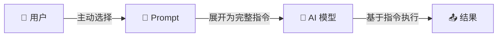
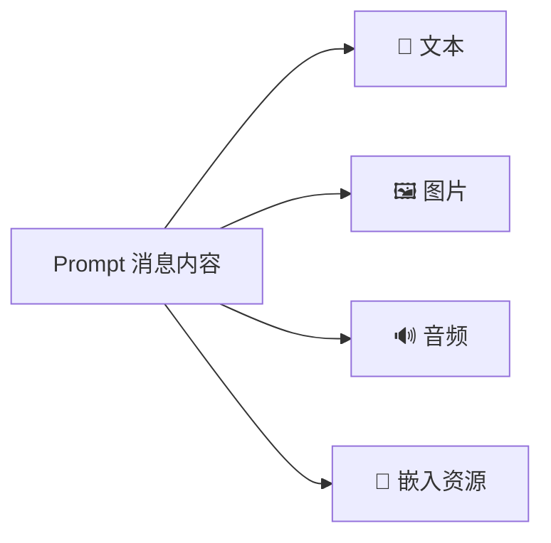
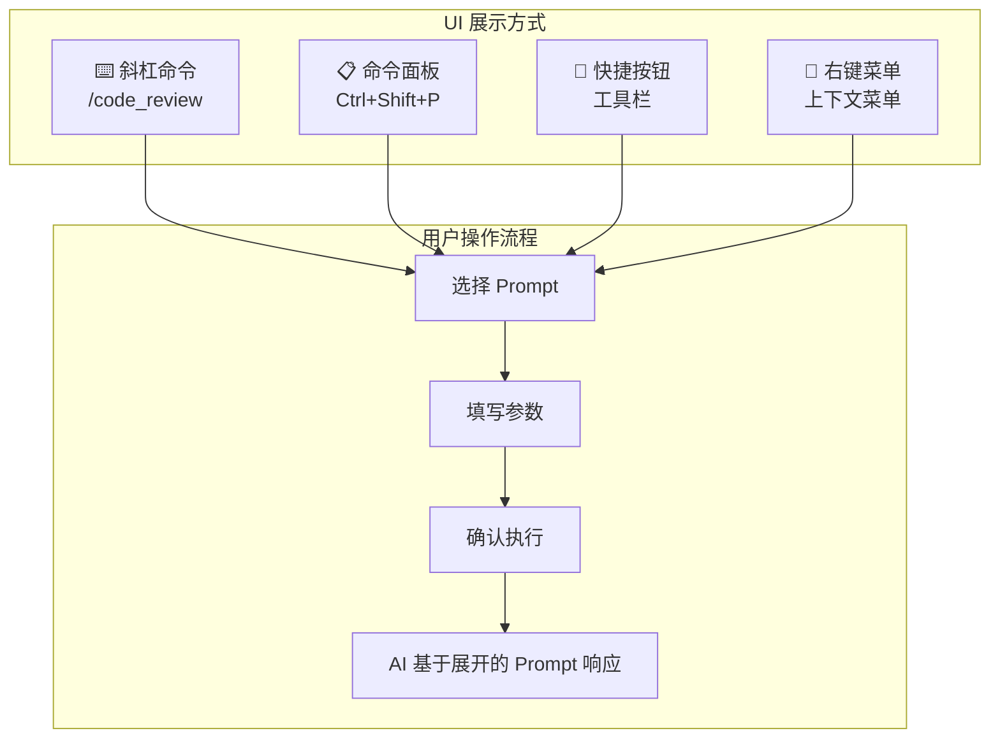

# 📝 08 — 服务端能力 — 提示词模板（Prompts）

## 什么是 Prompt？

Prompt（提示词模板）是 MCP Server 提供的**预定义指令模板**。它把特定场景的最佳 prompt 封装起来，用户选择后自动展开为完整的对话指令。

用一个类比来理解：

> 如果 Tool 是"工具箱里的工具"，Resource 是"参考资料架上的文件"，那么 Prompt 就是"标准操作手册"——它告诉你和 AI 在特定场景下该怎么做。

### 控制模型

Prompt 由**用户控制**——只有用户主动选择时才会激活，AI 不会自动触发。



**为什么需要用户控制？**

Tool 已经让 AI 可以执行操作了，为什么还需要 Prompt？因为有些场景需要的不是一次工具调用，而是一套**完整的工作流**：

```
Tool: get_weather("北京")  → 单点操作

Prompt: plan_vacation(destination="北京", days=5)
  → 展开为一段完整的规划指令：
    "请为我规划一个 5 天的北京之旅。
     请考虑以下方面：
     1. 每天的景点安排
     2. 餐饮推荐
     3. 交通建议
     4. 预算估算
     请使用 get_weather 查询天气，用 search_attractions 搜索景点..."
```

---

## 📋 Prompt 的定义结构

```json
{
  "name": "code_review",
  "title": "代码审查",
  "description": "对指定代码进行质量分析，检查潜在问题并提供改进建议",
  "arguments": [
    {
      "name": "code",
      "description": "需要审查的代码内容",
      "required": true
    },
    {
      "name": "language",
      "description": "编程语言，如 python、javascript",
      "required": false
    },
    {
      "name": "focus",
      "description": "审查重点，如 security（安全）、performance（性能）、readability（可读性）",
      "required": false
    }
  ],
  "icons": [
    {
      "uri": "https://example.com/icons/code-review.png",
      "mediaType": "image/png"
    }
  ]
}
```

### 字段说明

| 字段          | 必填 | 说明                   |
| ------------- | ---- | ---------------------- |
| `name`        | ✅   | 唯一标识符             |
| `title`       | ❌   | 人类可读的显示名称     |
| `description` | ❌   | 详细描述               |
| `arguments`   | ❌   | 参数列表（用于定制化） |
| `icons`       | ❌   | UI 展示图标            |

---

## 🔍 发现提示词：`prompts/list`

```json
// 请求
{
  "jsonrpc": "2.0",
  "id": 1,
  "method": "prompts/list"
}

// 响应
{
  "jsonrpc": "2.0",
  "id": 1,
  "result": {
    "prompts": [
      {
        "name": "code_review",
        "title": "代码审查",
        "description": "分析代码质量并提供改进建议",
        "arguments": [
          { "name": "code", "description": "要审查的代码", "required": true }
        ]
      },
      {
        "name": "explain_concept",
        "title": "概念解释",
        "description": "用通俗易懂的方式解释技术概念",
        "arguments": [
          { "name": "concept", "description": "要解释的概念", "required": true },
          { "name": "level", "description": "目标受众水平：beginner/intermediate/expert", "required": false }
        ]
      },
      {
        "name": "summarize_meeting",
        "title": "会议纪要",
        "description": "根据会议记录生成结构化纪要",
        "arguments": [
          { "name": "notes", "description": "会议原始笔记", "required": true }
        ]
      }
    ]
  }
}
```

---

## 📥 获取提示词：`prompts/get`

获取展开后的完整提示词内容：

````json
// 请求
{
  "jsonrpc": "2.0",
  "id": 2,
  "method": "prompts/get",
  "params": {
    "name": "code_review",
    "arguments": {
      "code": "def add(a, b):\n    return a + b",
      "language": "python",
      "focus": "readability"
    }
  }
}

// 响应
{
  "jsonrpc": "2.0",
  "id": 2,
  "result": {
    "description": "Python 代码审查 - 可读性分析",
    "messages": [
      {
        "role": "user",
        "content": {
          "type": "text",
          "text": "请对以下 Python 代码进行审查，重点关注可读性方面：\n\n```python\ndef add(a, b):\n    return a + b\n```\n\n请从以下维度分析：\n1. 命名是否清晰\n2. 是否有类型注解\n3. 是否有文档字符串\n4. 代码结构是否合理\n\n请给出具体的改进建议和改进后的代码。"
        }
      }
    ]
  }
}
````

### 返回结构

`prompts/get` 返回的 `messages` 数组可以包含多条消息，每条消息有角色（role）和内容（content）。

**支持的角色**：

- `"user"` — 用户消息
- `"assistant"` — 助手消息（预设的示例回答）

### 内容类型

Prompt 消息支持多种内容格式：



**嵌入资源的示例**：

```json
{
  "role": "user",
  "content": {
    "type": "resource",
    "resource": {
      "uri": "file:///project/src/main.py",
      "mimeType": "text/x-python",
      "text": "# main.py 的完整内容..."
    }
  }
}
```

这使得 Prompt 可以自动引用 Server 的资源——比如一个"代码审查"的 Prompt 可以自动把目标文件的内容嵌入到消息中。

---

## 🎨 用户交互模式

Prompt 通常通过以下 UI 模式暴露给用户：



**VS Code 中的典型实现**：

```
用户输入：/code_review

VS Code 展示参数表单：
  代码 [必填]: _______________
  语言 [选填]: python ▼
  重点 [选填]: readability ▼

用户填写后点击"执行"
→ AI 收到展开后的完整 prompt 并开始回答
```

---

## 🔄 动态 Prompt

### 列表变更通知

如果 Server 声明了 `prompts.listChanged` 能力，可以在运行时动态添加或修改 Prompt：

```json
// Server → Client：通知 Prompt 列表已变更
{
  "jsonrpc": "2.0",
  "method": "notifications/prompts/list_changed"
}
```

Client 收到通知后应重新调用 `prompts/list`。

### 参数自动补全

Prompt 的参数支持自动补全，提升用户体验：

```json
// 请求补全
{
  "jsonrpc": "2.0",
  "id": 3,
  "method": "completion/complete",
  "params": {
    "ref": {
      "type": "ref/prompt",
      "name": "code_review"
    },
    "argument": {
      "name": "language",
      "value": "py"
    }
  }
}

// 响应
{
  "jsonrpc": "2.0",
  "id": 3,
  "result": {
    "completion": {
      "values": ["python", "pytorch"],
      "hasMore": false
    }
  }
}
```

---

## 🆚 三种原语的对比总结

通过一个**智能助教系统**的例子，对比三种原语的使用场景：

```
🎓 智能助教 MCP Server

Tools（AI 调用的函数）：
  - run_code(language, code)         → 执行代码片段
  - search_docs(query)               → 搜索文档
  - grade_assignment(student, code)   → 评分

Resources（应用读取的数据）：
  - course://syllabus                → 课程大纲
  - course://students/{id}/history   → 学生学习记录
  - course://materials/{topic}       → 教学材料

Prompts（用户触发的工作流）：
  - explain_topic(topic, level)      → "请用XXX水平解释YYY概念"
  - review_homework(student)         → "审查学生作业并给出反馈"
  - create_quiz(topic, difficulty)   → "生成关于XXX的测验题"
```

| 维度         | Tool         | Resource   | Prompt         |
| ------------ | ------------ | ---------- | -------------- |
| **发起者**   | AI 模型      | Host 应用  | 用户           |
| **动作类型** | 执行操作     | 读取数据   | 触发工作流     |
| **确认要求** | 需要人类确认 | 通常不需要 | 用户主动触发   |
| **返回值**   | 操作结果     | 数据内容   | 展开的消息模板 |
| **典型数量** | 几个到几十个 | 可以非常多 | 几个到十几个   |

---

## 📌 小结

| 概念         | 要点                                          |
| ------------ | --------------------------------------------- |
| Prompt 定位  | 预定义的指令模板，用户主动触发                |
| 关键协议方法 | `prompts/list`（发现）、`prompts/get`（获取） |
| 参数化       | 支持必选和可选参数，支持自动补全              |
| 内容类型     | 文本、图片、音频、嵌入资源                    |
| UI 展示      | 斜杠命令、命令面板、按钮、右键菜单            |
| 动态变更     | 支持列表变更通知                              |

---

> 📖 **下一章**：[客户端能力](./09-client-features.md) — 学习 Sampling、Roots 和 Elicitation 三大客户端能力。
