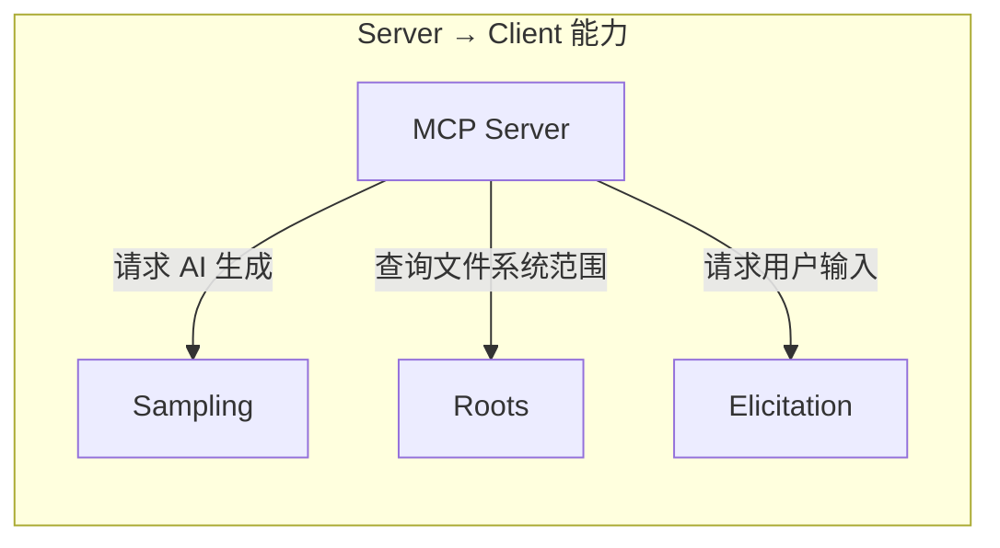
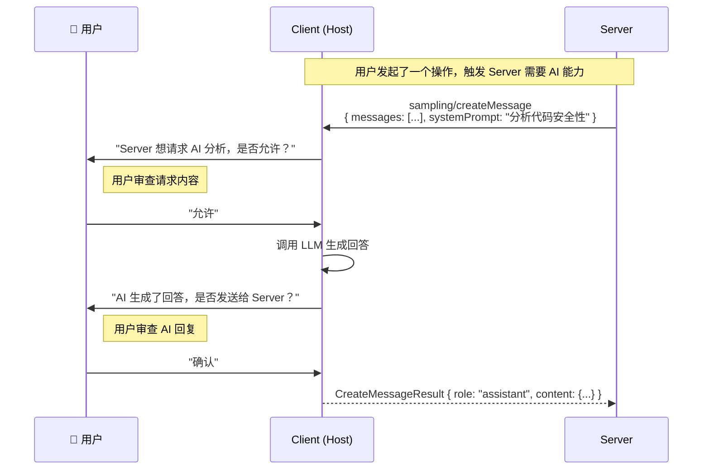
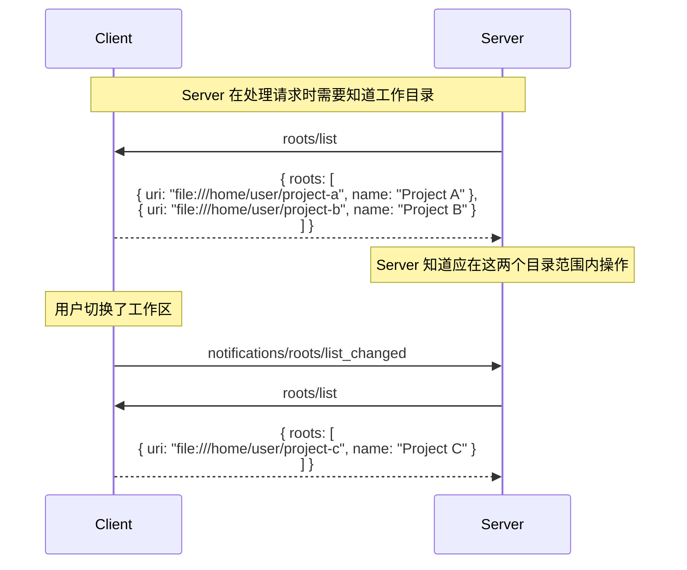
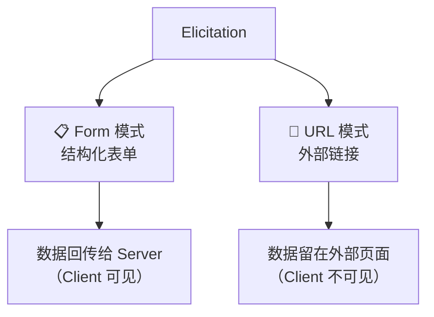
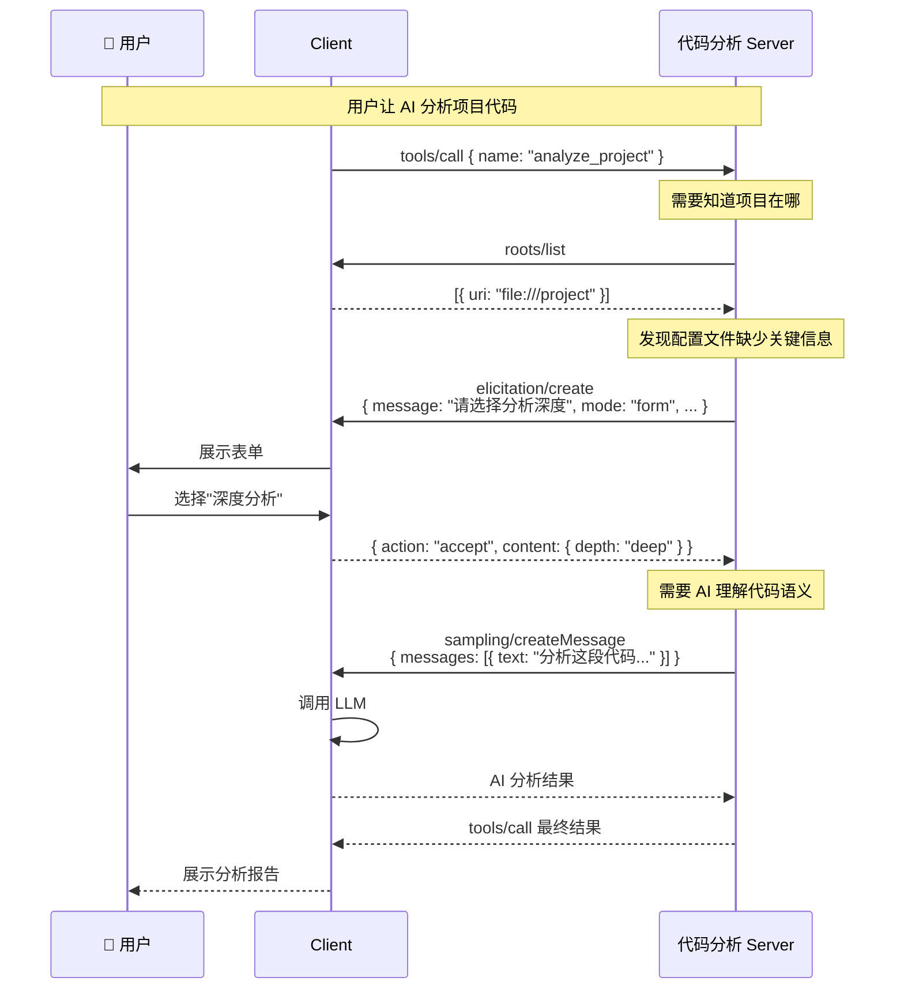

# 🔄 09 — 客户端能力

MCP 不只是单向的"Server 服务 Client"——Client 也可以向 Server 暴露能力。这种双向设计使得 Server 可以利用 Host 的 AI 能力和用户交互能力，而不需要自己集成这些复杂功能。



---

## 🤖 Sampling — 让 Server 借用 AI 能力

### 核心思想

Sampling 允许 Server **请求 Client 的 AI 生成文本**。这意味着 Server 可以实现复杂的"智能体"（Agent）行为，而不需要自己集成任何 LLM。

**为什么需要这个设计？**

假设你开发了一个代码分析 Server，它能读取代码文件、计算复杂度指标。但如果你想让它"理解"代码的含义——比如判断这段代码是否有安全漏洞——你需要 LLM 的推理能力。

传统做法：Server 自己调用 OpenAI/Anthropic 的 API。
问题：Server 需要管理 API 密钥，用户没有控制权，成本不透明。

MCP 做法：Server 通过 Sampling 向 Client 请求 AI 生成。
好处：

- Server **无需 API 密钥**（Client 已有 LLM 接入）
- 用户**可以审查**请求和响应
- Client 控制**使用哪个模型**和**花费多少**

### 工作流程



### 请求格式

```json
{
  "jsonrpc": "2.0",
  "id": 1,
  "method": "sampling/createMessage",
  "params": {
    "messages": [
      {
        "role": "user",
        "content": {
          "type": "text",
          "text": "请分析以下代码是否存在 SQL 注入漏洞：\n\nquery = f\"SELECT * FROM users WHERE id = {user_input}\""
        }
      }
    ],
    "systemPrompt": "你是一个代码安全分析专家。",
    "modelPreferences": {
      "intelligencePriority": 0.8,
      "speedPriority": 0.3,
      "costPriority": 0.5
    },
    "maxTokens": 1000
  }
}
```

### 模型偏好

Server 可以通过 `modelPreferences` 表达对模型选择的偏好，但最终决定权在 Client：

```json
{
  "modelPreferences": {
    "hints": [{ "name": "claude-3-sonnet" }, { "name": "gpt-4" }],
    "intelligencePriority": 0.8,
    "speedPriority": 0.3,
    "costPriority": 0.5
  }
}
```

- `hints`：建议使用的模型（Client 可以忽略）
- `intelligencePriority`：智能程度优先级（0-1）
- `speedPriority`：速度优先级（0-1）
- `costPriority`：成本优先级（0-1）

### 带工具的 Sampling

Sampling 还支持让 AI 在生成过程中使用工具，实现更复杂的"智能体循环"：

```json
{
  "method": "sampling/createMessage",
  "params": {
    "messages": [...],
    "tools": [
      {
        "name": "search_code",
        "description": "在代码库中搜索",
        "inputSchema": {
          "type": "object",
          "properties": {
            "query": { "type": "string" }
          }
        }
      }
    ],
    "toolChoice": { "type": "auto" }
  }
}
```

**能力声明**：Client 必须在初始化时声明支持 Sampling 及工具调用：

```json
{
  "capabilities": {
    "sampling": {
      "tools": {}
    }
  }
}
```

### 关键约束

⚠️ Server **只能**在处理 Client 请求（如 `tools/call`）期间发送 `sampling/createMessage`，不能主动发起独立的 Sampling 请求。这确保了每次 AI 调用都有明确的上下文。

---

## 📂 Roots — 告诉 Server 能访问哪里

### 核心思想

Roots 让 Client 告知 Server 可以访问的**文件系统范围**——就像给 Server 画一个"活动区域"。

**关键认知**：Roots 是**建议性**的，不是安全边界。它像办公室里的"请在这个区域工作"标识，不是上了锁的门。

### 工作流程



### Root 结构

```json
{
  "uri": "file:///home/user/projects/my-app",
  "name": "My Application"
}
```

- `uri`：必须是 `file://` 协议的 URI
- `name`：可选的人类可读名称

### 使用场景

| 场景         | Roots 示例                         |
| ------------ | ---------------------------------- |
| IDE 工作区   | 当前打开的项目目录                 |
| 多仓库工作   | monorepo 中的几个子包目录          |
| 文件管理工具 | 用户指定的管理目录                 |
| 配置文件搜索 | 限定搜索范围，避免扫描整个文件系统 |

---

## 💬 Elicitation — 向用户要信息

### 核心思想

Elicitation 允许 Server 在处理请求时**向用户请求额外信息**——比如在旅行预订过程中询问座位偏好。

### 两种模式



### Form 模式

用于收集非敏感的结构化信息：

```json
{
  "jsonrpc": "2.0",
  "id": 1,
  "method": "elicitation/create",
  "params": {
    "message": "请提供您的旅行偏好，以便为您定制行程",
    "mode": "form",
    "requestedSchema": {
      "type": "object",
      "properties": {
        "seat_preference": {
          "type": "string",
          "title": "座位偏好",
          "enum": ["靠窗", "靠过道", "无偏好"],
          "description": "您在飞机上更喜欢哪种座位？"
        },
        "meal_type": {
          "type": "string",
          "title": "餐食类型",
          "enum": ["普通", "素食", "清真", "无"],
          "description": "您的餐食偏好"
        },
        "budget_max": {
          "type": "number",
          "title": "预算上限（元）",
          "minimum": 0,
          "description": "本次旅行的最高预算"
        }
      },
      "required": ["seat_preference"]
    }
  }
}
```

**用户响应示例**：

```json
{
  "jsonrpc": "2.0",
  "id": 1,
  "result": {
    "action": "accept",
    "content": {
      "seat_preference": "靠窗",
      "meal_type": "普通",
      "budget_max": 5000
    }
  }
}
```

用户也可以拒绝：

```json
{
  "result": {
    "action": "decline",
    "content": null
  }
}
```

### URL 模式

用于敏感信息（密码、API 密钥等），数据不经过 Client：

```json
{
  "method": "elicitation/create",
  "params": {
    "message": "请在以下页面完成支付授权",
    "mode": "url",
    "url": "https://payment.example.com/authorize?session=abc123"
  }
}
```

Client 会打开这个 URL 让用户在浏览器中完成操作。数据直接在用户和目标网站之间传递，不经过 MCP 通信链路。

### ⚠️ 安全红线

```
Form 模式 ❌ 绝对不能用于收集：
  - 密码
  - API 密钥 / 访问令牌
  - 支付信息（信用卡号等）
  - 其他高敏感数据

这些必须使用 URL 模式！
```

原因：Form 模式的数据会经过 Client，Client 能看到并可能记录这些数据。URL 模式让敏感数据走独立通道，MCP 通信链路上不会出现这些数据。

### 能力声明

```json
{
  "capabilities": {
    "elicitation": {
      "form": {},
      "url": {}
    }
  }
}
```

Client 可以只支持其中一种模式。为了向后兼容，空对象 `{}` 等同于只支持 Form 模式。

---

## 📊 三种客户端能力对比

| 能力            | 场景                    | 数据流向               | 安全控制           |
| --------------- | ----------------------- | ---------------------- | ------------------ |
| **Sampling**    | Server 需要 AI 推理     | Server → Client AI     | 人工审查请求和回复 |
| **Roots**       | Server 需要知道工作范围 | Client → Server        | 建议性边界         |
| **Elicitation** | Server 需要用户信息     | Server → 用户 → Server | 用户可拒绝         |

用一个完整的例子把三者串联起来：



---

## 📌 小结

| 能力        | 核心作用                | 控制方 | 安全要点                  |
| ----------- | ----------------------- | ------ | ------------------------- |
| Sampling    | Server 借用 AI 推理能力 | Client | 人工审查，不泄露 API 密钥 |
| Roots       | 告知 Server 工作范围    | Client | 建议性边界，非安全隔离    |
| Elicitation | 动态收集用户信息        | 用户   | 敏感数据必须用 URL 模式   |

---

> 📖 **下一章**：[安全机制与授权](./10-security.md) — 深入了解 MCP 的安全设计和 OAuth 授权流程。
