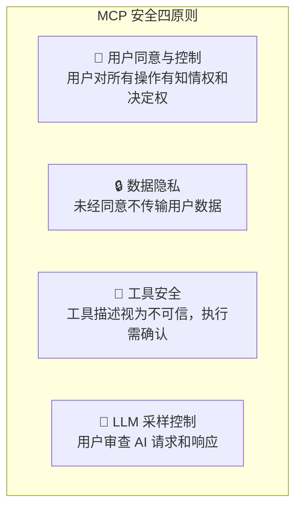
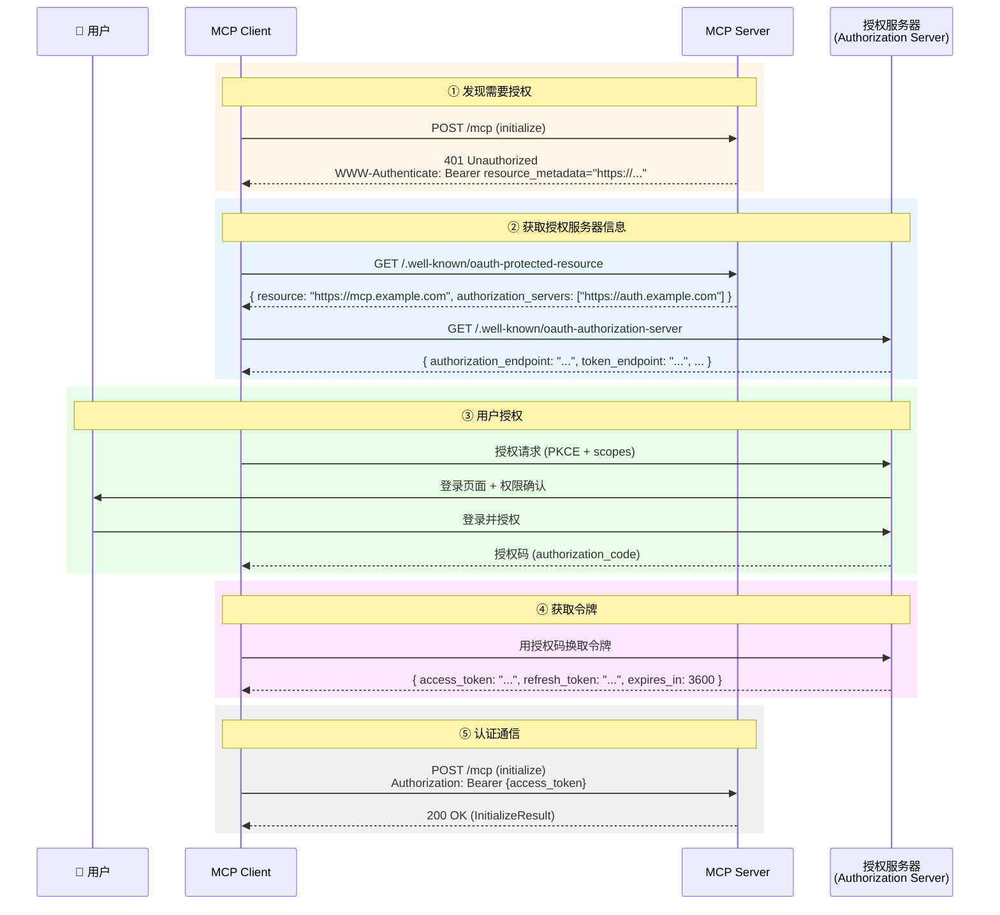
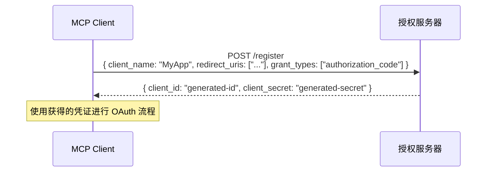
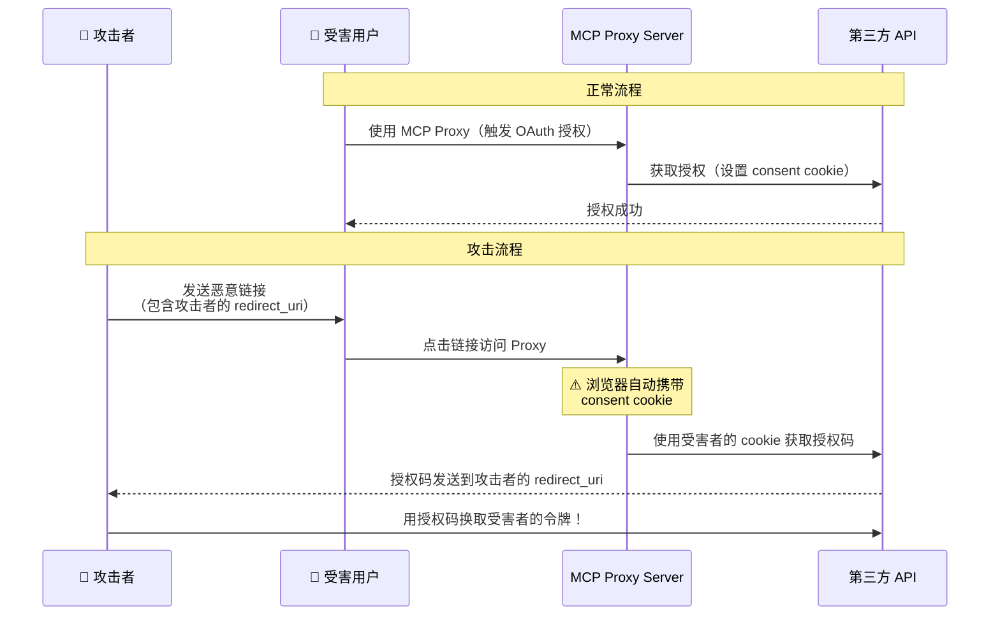
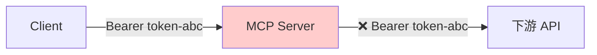
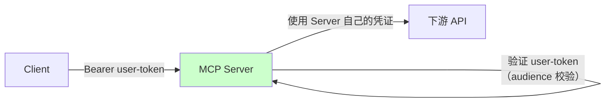

# 🔐 10 — 安全机制与授权

## MCP 的安全哲学

MCP 在设计之初就将安全作为核心关切。协议定义了四大安全原则：



这些原则贯穿协议的每个设计决策。理解它们，就能理解 MCP 中很多"为什么要这么做"。

---

## 🔑 授权框架

### 何时需要授权？

| 场景                        | 是否需要授权 | 原因                     |
| --------------------------- | ------------ | ------------------------ |
| 本地 stdio Server           | 通常不需要   | 进程隔离提供安全性       |
| 远程 HTTP Server（公开数据）| 可能不需要   | 取决于数据敏感程度       |
| 远程 HTTP Server（用户数据）| ✅ 需要      | 必须验证用户身份和权限   |
| 企业内部 Server             | ✅ 需要      | 访问控制和审计要求       |

### OAuth 2.1 授权流程

MCP 的 HTTP 传输采用 **OAuth 2.1** 标准进行授权。整个流程涉及四个参与者：



### 授权发现机制

MCP 支持多种方式发现授权服务器：

**方式 1：WWW-Authenticate 头**

Server 在返回 401 时通过响应头指示：

```http
HTTP/1.1 401 Unauthorized
WWW-Authenticate: Bearer resource_metadata="https://server.example.com/.well-known/oauth-protected-resource"
```

**方式 2：Well-Known URI**

Client 主动查询 Server 的授权元数据：

```http
GET /.well-known/oauth-protected-resource HTTP/1.1
Host: server.example.com
```

```json
{
  "resource": "https://server.example.com",
  "authorization_servers": [
    "https://auth.example.com"
  ],
  "scopes_supported": ["mcp:tools", "mcp:resources", "mcp:prompts"]
}
```

### 动态客户端注册

对于未预先注册的 Client，MCP 支持 **RFC 7591 动态客户端注册**：



这让新的 MCP Client 可以自动注册，不需要管理员手动配置。

---

## ⚔️ 安全攻防

### 攻击 1：混淆代理攻击（Confused Deputy）

这是 MCP 代理场景中最值得关注的安全风险：



### 防护措施

```
✅ 实施"按客户端同意"（per-client consent）
   - 每个新 client_id 都需要独立的用户确认
   - 同意 UI 必须展示请求者的客户端名称

✅ Consent Cookie 安全设置
   - 使用 __Host- 前缀
   - 设置 Secure, HttpOnly, SameSite=Lax
   - 加密签名
   - 绑定到特定 client_id

✅ 精确匹配 redirect_uri
   - 不允许模式匹配或通配符
   - 注册时确定，运行时严格校验

✅ state 参数保护
   - 加密安全的随机值
   - 一次性使用
   - 短期过期（≤10 分钟）
```

### 攻击 2：令牌透传（Token Passthrough）

这是一个**反模式**——MCP Server 不应该把收到的令牌直接转发给下游 API：



**为什么危险？**

- 绕过了速率限制和请求验证
- 无法审计——下游 API 分不清请求来自 MCP 还是直接调用
- Server 不应该"代理"用户的令牌

**正确做法**：



Server 应该：
1. 验证收到的令牌是颁发给**自己**的（audience 校验）
2. 使用自己的凭证访问下游 API
3. 实施独立的访问控制逻辑

---

## 🛡️ 传输层安全

### DNS 重绑定防护

```python
# Server 端必须校验 Origin 头
@app.before_request
def check_origin():
    origin = request.headers.get('Origin')
    allowed_origins = ['https://trusted-client.example.com']

    if origin and origin not in allowed_origins:
        return Response('Forbidden', status=403)
```

### HTTPS 要求

```
远程 MCP Server：
  ✅ 必须使用 HTTPS
  ✅ 证书必须有效
  ❌ 不允许 HTTP（即使在内网）

本地 MCP Server：
  ✅ 绑定到 127.0.0.1（不是 0.0.0.0）
  ⚠️ 校验 Origin 头
```

### 会话 ID 安全

```
✅ 使用加密安全的随机生成器（如 UUID v4 或 JWT）
✅ 只通过 HTTPS 传输
✅ 定期轮换
✅ 安全存储（不记录到日志）
```

---

## 🏗️ 实战：Keycloak 授权服务器配置

以 Keycloak（开源身份认证服务）为例，展示如何为 MCP Server 配置授权：

### 1. 启动 Keycloak

```bash
docker run -p 127.0.0.1:8080:8080 \
  -e KC_BOOTSTRAP_ADMIN_USERNAME=admin \
  -e KC_BOOTSTRAP_ADMIN_PASSWORD=admin \
  quay.io/keycloak/keycloak:26.2.4 start-dev
```

### 2. 配置步骤

```
1. 创建 Realm（如 "mcp-realm"）
2. 创建 Client Scope（如 "mcp:tools"）
3. 注册 MCP Server 的 Client：
   - Client ID: mcp-weather-server
   - Client Authentication: ON
   - Valid Redirect URIs: *（开发环境）
4. 启用动态客户端注册（DCR）
5. 配置 Audience Mapper（确保令牌包含正确的 audience）
```

### 3. Server 端令牌验证

```python
import jwt
from functools import wraps

def require_auth(f):
    @wraps(f)
    def decorated(*args, **kwargs):
        token = request.headers.get('Authorization', '').replace('Bearer ', '')

        try:
            # 验证令牌
            payload = jwt.decode(
                token,
                key=get_public_key(),  # 从 Keycloak 获取公钥
                algorithms=['RS256'],
                audience='mcp-weather-server',  # 验证 audience
                issuer='https://auth.example.com/realms/mcp-realm'
            )
        except jwt.InvalidTokenError:
            return Response('Unauthorized', status=401)

        return f(*args, **kwargs)
    return decorated
```

---

## 📋 安全检查清单

### Server 开发者

```
□ 输入验证
  □ 校验所有工具参数的类型和范围
  □ 清洗 URI 参数（防止路径遍历）
  □ 限制参数长度

□ 访问控制
  □ 实现 OAuth 令牌验证（HTTP 传输）
  □ 校验令牌的 audience
  □ 按 scope 限制可访问的工具/资源

□ 通信安全
  □ 远程部署使用 HTTPS
  □ 本地绑定 127.0.0.1
  □ 校验 Origin 头

□ 运维安全
  □ 不在日志中记录敏感信息
  □ 实施速率限制
  □ 错误信息不泄露内部细节
```

### Client 开发者

```
□ 用户控制
  □ 工具调用前展示确认对话框
  □ 展示 Server 的身份信息
  □ 允许用户审查 Sampling 请求
  □ 提供 Elicitation 的拒绝选项

□ 令牌管理
  □ 安全存储令牌（系统密钥链）
  □ 实现令牌刷新
  □ 会话结束时清理令牌

□ 连接安全
  □ 验证 Server 的 TLS 证书
  □ 不连接未验证的 Server
  □ 定期审计已连接的 Server
```

---

## 📌 小结

| 概念             | 要点                                           |
| ---------------- | ---------------------------------------------- |
| 安全原则         | 用户同意、数据隐私、工具安全、采样控制         |
| 授权标准         | OAuth 2.1（HTTP 传输）                         |
| 发现机制         | WWW-Authenticate 头 / Well-Known URI           |
| 主要威胁         | 混淆代理攻击、令牌透传                         |
| 传输安全         | HTTPS、Origin 校验、127.0.0.1 绑定            |
| 令牌安全         | Audience 校验、安全存储、定期轮换              |

---

> 📖 **下一章**：[扩展机制](./11-extensions.md) — 了解如何在不修改核心协议的情况下扩展 MCP 功能。
