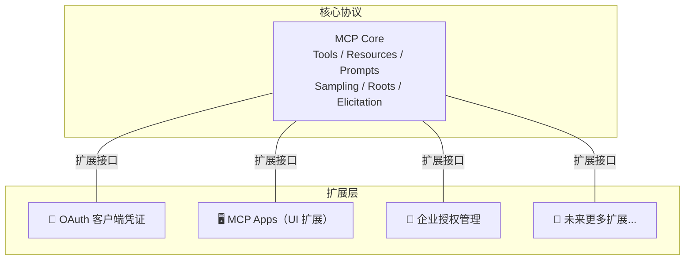
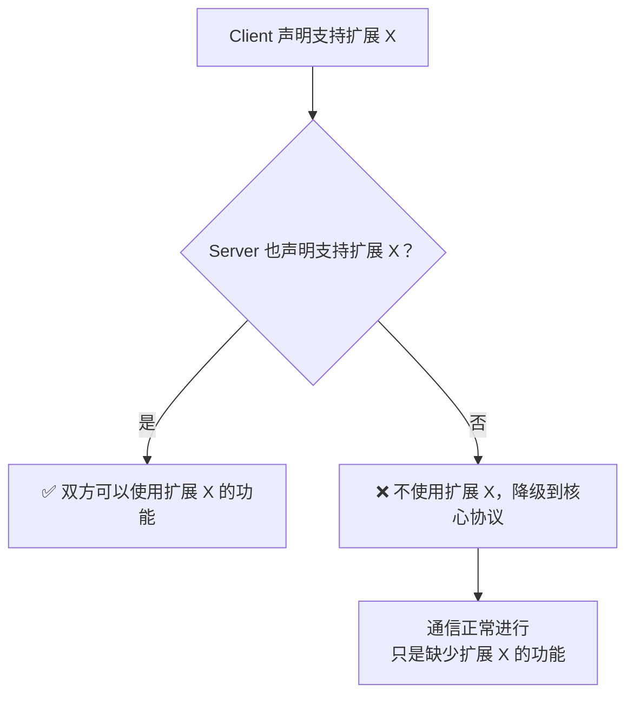
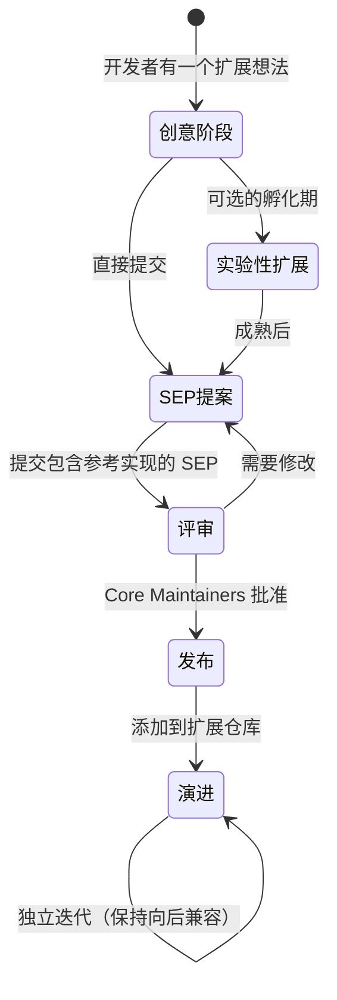
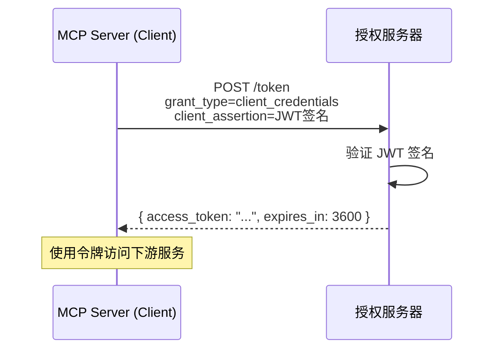

# 🧩 11 — 扩展机制

## 为什么需要扩展？

MCP 核心协议力求精简——只包含所有实现都需要的基础功能。但现实中总有各种特殊需求：

- 企业需要特定的认证方式
- 某些场景需要 UI 交互能力
- 新的 AI 能力不断涌现

如果把所有功能都塞进核心协议，协议会变得臃肿，每个实现者都要支持一大堆可能用不到的特性。

MCP 的解决方案：**扩展框架**——让核心保持精简，额外功能通过独立扩展模块添加。



---

## 🏷️ 扩展标识符

每个扩展通过唯一标识符来识别，格式为 `{vendor-prefix}/{extension-name}`：

```
io.modelcontextprotocol/oauth-client-credentials   ← 官方扩展
io.modelcontextprotocol/ui                          ← 官方扩展
com.example/custom-auth                             ← 第三方扩展
org.mycompany/internal-logging                      ← 企业私有扩展
```

### 命名规则

| 前缀类型                   | 示例                         | 含义         |
| -------------------------- | ---------------------------- | ------------ |
| `io.modelcontextprotocol/` | `io.modelcontextprotocol/ui` | MCP 官方扩展 |
| 反向域名                   | `com.example/my-ext`         | 第三方扩展   |

**保留前缀**：包含 `modelcontextprotocol` 或 `mcp` 的前缀被 MCP 官方保留。

**为什么用反向域名？**

这是 Java 包命名和 DNS 的思路——反向域名天然具有全球唯一性，不同组织的扩展不会冲突。

---

## 🤝 扩展协商

扩展在初始化阶段通过 `extensions` 字段进行协商：

```json
// Client 声明支持的扩展
{
  "method": "initialize",
  "params": {
    "protocolVersion": "2025-11-25",
    "capabilities": {
      "roots": {},
      "extensions": {
        "io.modelcontextprotocol/oauth-client-credentials": {},
        "io.modelcontextprotocol/ui": {
          "mimeTypes": ["text/html;profile=mcp-app"]
        }
      }
    }
  }
}
```

```json
// Server 声明支持的扩展
{
  "result": {
    "protocolVersion": "2025-11-25",
    "capabilities": {
      "tools": {},
      "extensions": {
        "io.modelcontextprotocol/oauth-client-credentials": {
          "grant_types": ["client_credentials"]
        }
      }
    }
  }
}
```

### 协商规则



**优雅降级**：如果一方不支持某个扩展，通信不会中断——只是缺少该扩展提供的功能。这是"渐进增强"思想的体现。

---

## 📦 扩展类型

### 1. 官方扩展

由 MCP 维护者管理，存放在 MCP 组织的 `ext-{area}` 仓库中：

| 扩展仓库   | 包含的扩展                     |
| ---------- | ------------------------------ |
| `ext-auth` | OAuth 客户端凭证、企业授权管理 |
| `ext-apps` | MCP Apps（UI 交互元素）        |

### 2. 实验性扩展

处于探索阶段的扩展，存放在 `experimental-ext-{name}` 仓库中：

- 关联工作组或兴趣小组
- 明确标记为实验性
- 可以通过 SEP 流程升级为官方扩展

### 3. 非官方扩展

由社区开发者自行开发和维护，不受 MCP 治理流程约束。

---

## 🔄 扩展生命周期



### 从创意到发布

1. **创建**：开发者实现扩展，可选择在 `experimental-ext-` 仓库中孵化
2. **提案**：编写 Standards Track SEP（Extensions Track），附带参考实现
3. **评审**：Core Maintainers 审核
4. **发布**：添加到官方扩展仓库
5. **演进**：独立于核心协议迭代，但必须保持向后兼容

---

## 📖 现有官方扩展介绍

### OAuth 客户端凭证（Machine-to-Machine）

**标识符**：`io.modelcontextprotocol/oauth-client-credentials`

**用途**：机器对机器的认证，无需用户交互。适用于后台服务、CI/CD 流水线、守护进程等。



**两种凭证格式**：

| 格式          | 安全性 | 适用场景         |
| ------------- | ------ | ---------------- |
| JWT 断言      | 高     | 推荐，基于公私钥 |
| Client Secret | 中     | 简单场景         |

### MCP Apps（UI 扩展）

**标识符**：`io.modelcontextprotocol/ui`

**用途**：让 MCP Server 返回交互式 UI 元素（图表、表单、视频播放器等），而不仅是文本。

```json
{
  "capabilities": {
    "extensions": {
      "io.modelcontextprotocol/ui": {
        "mimeTypes": ["text/html;profile=mcp-app"]
      }
    }
  }
}
```

---

## ⚠️ 向后兼容

扩展一旦发布，就需要谨慎处理变更：

### 什么是破坏性变更？

```
✅ 非破坏性（可以直接做）：
  - 添加新的可选字段
  - 放宽现有约束
  - 添加新的可选行为

❌ 破坏性（必须创建新扩展标识符）：
  - 删除或重命名字段
  - 改变字段类型
  - 改变语义行为
  - 添加新的必填字段
```

### 处理破坏性变更

**方法 1：能力标志**（推荐）

```json
{
  "io.modelcontextprotocol/my-ext": {
    "version": "2",
    "features": ["new-feature"]
  }
}
```

**方法 2：新的标识符**

```
io.modelcontextprotocol/my-ext      → 原版本
io.modelcontextprotocol/my-ext-v2   → 新版本（破坏性变更）
```

---

## 🔧 SDK 中的扩展支持

### 实现原则

- SDK **可以**（MAY）实现扩展，但不是必须的
- 扩展**必须默认禁用**，需要显式启用（opt-in）
- SDK 维护者对是否支持某个扩展有完全自主权

### 使用示例

```python
from mcp.server.fastmcp import FastMCP

mcp = FastMCP("my-server")

# 启用扩展（伪代码）
mcp.enable_extension("io.modelcontextprotocol/oauth-client-credentials", {
    "grant_types": ["client_credentials"]
})
```

---

## 📌 小结

| 概念       | 要点                                       |
| ---------- | ------------------------------------------ |
| 扩展定位   | 核心协议之外的可选功能模块                 |
| 标识符格式 | `{vendor-prefix}/{name}`（反向域名）       |
| 协商方式   | 初始化时通过 `extensions` 字段声明         |
| 降级策略   | 不支持则忽略，不影响基础通信               |
| 扩展类型   | 官方 / 实验性 / 非官方                     |
| 向后兼容   | 非破坏性变更直接做，破坏性变更需要新标识符 |

---

> 📖 **下一章**：[实战：构建 MCP Server](./12-practice-server.md) — 从零开始构建一个完整的 MCP 服务器。
