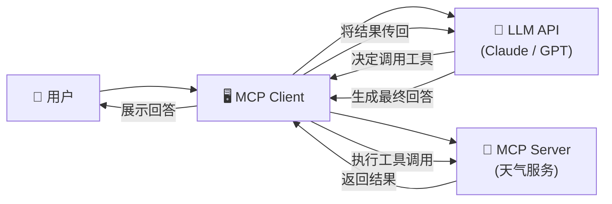
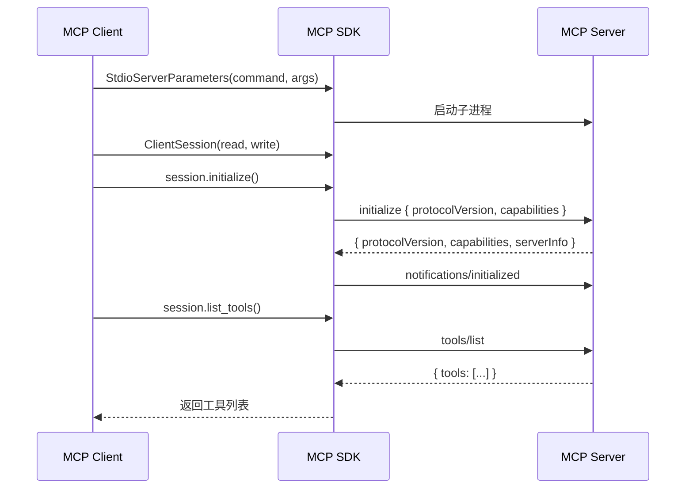
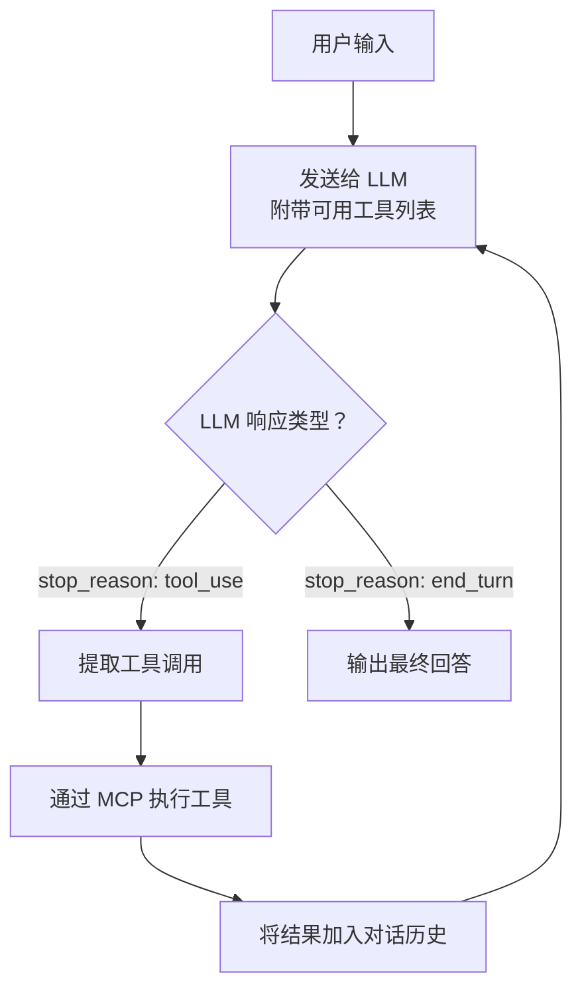

# 🖥️ 13 — 实战：构建 MCP Client

## 目标

本章带你实现一个 **MCP Client**，它能够：

1. 连接到 MCP Server（通过 stdio 传输）
2. 发现 Server 提供的工具
3. 结合 LLM API 实现对话式工具调用
4. 处理多轮交互

---

## 🏗️ 架构概览



核心流程：

1. 用户输入问题
2. Client 将问题 + 可用工具列表发给 LLM
3. LLM 决定是否需要调用工具
4. 如果需要，Client 通过 MCP 协议调用 Server 的工具
5. 将工具结果传回 LLM
6. LLM 生成最终回答

---

## 🐍 Python 实现

### 准备工作

```bash
pip install mcp anthropic python-dotenv
```

创建 `.env` 文件：

```
ANTHROPIC_API_KEY=your-api-key-here
```

### 完整代码

```python
"""
mcp_client.py
一个完整的 MCP Client 实现，连接 MCP Server 并通过 LLM 实现智能对话。
"""

import asyncio
import json
import sys
from contextlib import AsyncExitStack

from dotenv import load_dotenv
from anthropic import Anthropic
from mcp import ClientSession, StdioServerParameters
from mcp.client.stdio import stdio_client

load_dotenv()


class MCPClient:
    """MCP 客户端，管理与 Server 的连接和 LLM 交互。"""

    def __init__(self):
        self.session: ClientSession | None = None
        self.exit_stack = AsyncExitStack()
        self.anthropic = Anthropic()
        self.available_tools = []

    async def connect_to_server(self, server_script: str):
        """连接到指定的 MCP Server。

        Args:
            server_script: Server 脚本路径（.py 或 .js）
        """
        # 根据文件扩展名确定启动命令
        if server_script.endswith(".py"):
            command = sys.executable  # 当前 Python 解释器
            args = [server_script]
        elif server_script.endswith(".js"):
            command = "node"
            args = [server_script]
        else:
            raise ValueError(f"不支持的脚本类型: {server_script}")

        # 配置 stdio 传输参数
        server_params = StdioServerParameters(
            command=command,
            args=args,
        )

        # 建立连接
        # stdio_client 负责启动子进程并建立通信通道
        stdio_transport = await self.exit_stack.enter_async_context(
            stdio_client(server_params)
        )

        # 在传输层之上创建 MCP 会话
        # read_stream / write_stream 分别对应 stdout / stdin
        read_stream, write_stream = stdio_transport
        self.session = await self.exit_stack.enter_async_context(
            ClientSession(read_stream, write_stream)
        )

        # 执行初始化握手（协议版本协商 + 能力交换）
        await self.session.initialize()

        # 发现 Server 的工具
        tools_result = await self.session.list_tools()
        self.available_tools = tools_result.tools

        print(f"✅ 已连接到 Server，发现 {len(self.available_tools)} 个工具：")
        for tool in self.available_tools:
            print(f"   🔧 {tool.name}: {tool.description}")

    def _get_tools_for_llm(self) -> list[dict]:
        """将 MCP 工具格式转换为 LLM API 格式。

        MCP 的工具定义和 Claude API 的工具定义格式略有不同，
        这里做一个适配转换。
        """
        return [
            {
                "name": tool.name,
                "description": tool.description or "",
                "input_schema": tool.inputSchema,
            }
            for tool in self.available_tools
        ]

    async def process_query(self, query: str, conversation: list) -> str:
        """处理用户查询。

        核心逻辑：
        1. 将用户消息和可用工具发给 LLM
        2. 如果 LLM 返回工具调用，执行并将结果反馈给 LLM
        3. 重复直到 LLM 给出最终文本回答

        Args:
            query: 用户输入的问题
            conversation: 对话历史
        Returns:
            AI 的最终回答
        """
        # 添加用户消息到对话历史
        conversation.append({"role": "user", "content": query})

        # 准备 LLM API 所需的工具定义
        tools = self._get_tools_for_llm()

        # 调用 LLM
        response = self.anthropic.messages.create(
            model="claude-sonnet-4-20250514",
            max_tokens=4096,
            messages=conversation,
            tools=tools if tools else None,
        )

        # 处理 LLM 的响应（可能包含多轮工具调用）
        while response.stop_reason == "tool_use":
            # 收集所有工具调用
            tool_calls = [
                block for block in response.content if block.type == "tool_use"
            ]

            # 执行每个工具调用
            tool_results = []
            for tool_call in tool_calls:
                print(f"   🔧 调用工具: {tool_call.name}({json.dumps(tool_call.input, ensure_ascii=False)})")

                # 通过 MCP 协议调用 Server 的工具
                result = await self.session.call_tool(
                    tool_call.name, tool_call.input
                )

                # 提取文本结果
                result_text = "\n".join(
                    content.text
                    for content in result.content
                    if hasattr(content, "text")
                )

                print(f"   📤 结果: {result_text[:100]}...")

                tool_results.append(
                    {
                        "type": "tool_result",
                        "tool_use_id": tool_call.id,
                        "content": result_text,
                    }
                )

            # 将 LLM 的响应和工具结果添加到对话历史
            conversation.append({"role": "assistant", "content": response.content})
            conversation.append({"role": "user", "content": tool_results})

            # 再次调用 LLM，让它基于工具结果生成回答
            response = self.anthropic.messages.create(
                model="claude-sonnet-4-20250514",
                max_tokens=4096,
                messages=conversation,
                tools=tools if tools else None,
            )

        # 提取最终文本回答
        final_text = "\n".join(
            block.text for block in response.content if hasattr(block, "text")
        )

        # 将助手回答添加到对话历史
        conversation.append({"role": "assistant", "content": final_text})

        return final_text

    async def chat_loop(self):
        """交互式对话循环。"""
        print("\n💬 MCP 智能助手已就绪（输入 'quit' 退出）\n")

        conversation = []

        while True:
            try:
                query = input("你: ").strip()
                if not query:
                    continue
                if query.lower() in ("quit", "exit", "q"):
                    print("👋 再见！")
                    break

                print("🤔 思考中...")
                response = await self.process_query(query, conversation)
                print(f"\n🤖 助手: {response}\n")

            except KeyboardInterrupt:
                print("\n👋 再见！")
                break
            except Exception as e:
                print(f"\n❌ 错误: {e}\n")

    async def cleanup(self):
        """清理资源。"""
        await self.exit_stack.aclose()


async def main():
    if len(sys.argv) < 2:
        print("用法: python mcp_client.py <server_script_path>")
        print("示例: python mcp_client.py path/to/weather_server.py")
        sys.exit(1)

    client = MCPClient()
    try:
        await client.connect_to_server(sys.argv[1])
        await client.chat_loop()
    finally:
        await client.cleanup()


if __name__ == "__main__":
    asyncio.run(main())
```

### 运行

```bash
python mcp_client.py path/to/weather_server/server.py
```

### 交互示例

```
✅ 已连接到 Server，发现 2 个工具：
   🔧 get_alerts: 获取美国指定州的天气预警信息
   🔧 get_forecast: 获取指定经纬度位置的天气预报

💬 MCP 智能助手已就绪（输入 'quit' 退出）

你: 加利福尼亚州有什么天气预警吗？
🤔 思考中...
   🔧 调用工具: get_alerts({"state": "CA"})
   📤 结果: ⚠️ Heat Advisory...

🤖 助手: 目前加利福尼亚州有以下天气预警：

1. **高温警告** - 涉及南加州地区，预计气温将达到 105°F（40°C）...
```

---

## 🔑 核心代码解析

### 连接流程



### 工具调用循环

这是 Client 中最核心的逻辑——一个"LLM ↔ Tool"的反馈循环：



这个循环保证了 LLM 可以进行多次工具调用来回答复杂问题，直到它认为信息足够给出最终答案。

---

## 🔌 连接远程 Server

上面的例子使用 stdio 传输。如果要连接远程 HTTP Server，需要使用不同的传输方式：

```python
from mcp.client.streamable_http import streamablehttp_client

async def connect_to_remote_server(url: str):
    """连接到远程 MCP Server。"""
    transport = await exit_stack.enter_async_context(
        streamablehttp_client(url)
    )
    read_stream, write_stream = transport
    session = await exit_stack.enter_async_context(
        ClientSession(read_stream, write_stream)
    )
    await session.initialize()
    return session
```

---

## ⚠️ 注意事项

### 1. 资源管理

```python
# ✅ 使用 AsyncExitStack 确保资源正确释放
async with AsyncExitStack() as stack:
    transport = await stack.enter_async_context(stdio_client(params))
    session = await stack.enter_async_context(ClientSession(...))
    # ... 使用 session ...
# 退出 with 块时自动清理
```

### 2. 多 Server 连接

Host 通常需要管理多个 Server 连接：

```python
class MultiServerClient:
    def __init__(self):
        self.sessions: dict[str, ClientSession] = {}

    async def connect(self, name: str, script: str):
        """连接到一个 Server 并以名称标识。"""
        # 为每个 Server 维护独立的 session
        session = await self._create_session(script)
        self.sessions[name] = session

    async def list_all_tools(self) -> list:
        """汇总所有 Server 的工具。"""
        all_tools = []
        for name, session in self.sessions.items():
            tools = await session.list_tools()
            for tool in tools.tools:
                # 为工具添加来源标识，避免不同 Server 的同名工具冲突
                tool._server_name = name
                all_tools.append(tool)
        return all_tools
```

### 3. 错误处理

```python
try:
    result = await session.call_tool(name, arguments)
    if result.isError:
        # 业务错误：工具执行了但返回了错误
        print(f"工具返回错误: {result.content}")
except McpError as e:
    # 协议错误：请求本身有问题
    print(f"MCP 协议错误: {e}")
except ConnectionError:
    # 连接错误：Server 断开了
    print("Server 连接断开，尝试重连...")
```

---

## 📌 小结

| 概念            | 要点                                      |
| --------------- | ----------------------------------------- |
| Client 核心职责 | 连接管理 + 协议桥接 + LLM 集成            |
| 连接流程        | 启动传输 → 创建会话 → 初始化握手          |
| 工具调用循环    | 用户输入 → LLM 判断 → 工具执行 → 反馈 LLM |
| 多 Server       | 每个 Server 一个独立 Session              |
| 传输方式        | stdio（本地）/ Streamable HTTP（远程）    |

---

> 📖 **下一章**：[进阶主题](./14-advanced-topics.md) — Tasks、版本管理、Schema 设计等高级话题。
