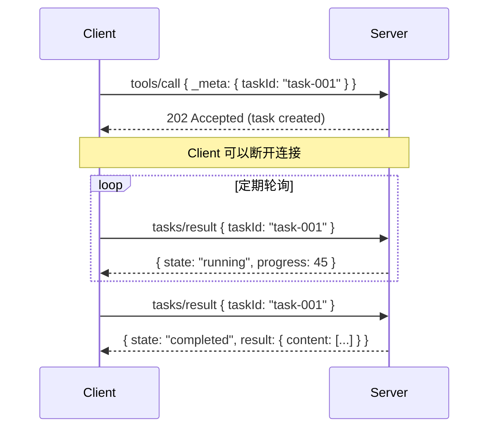
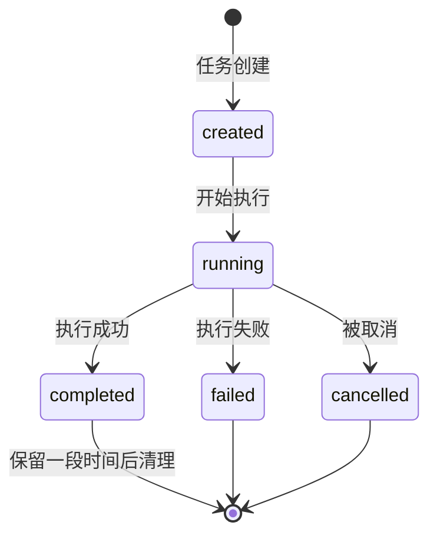
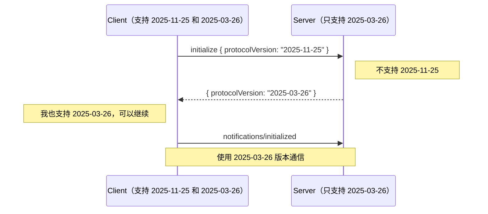
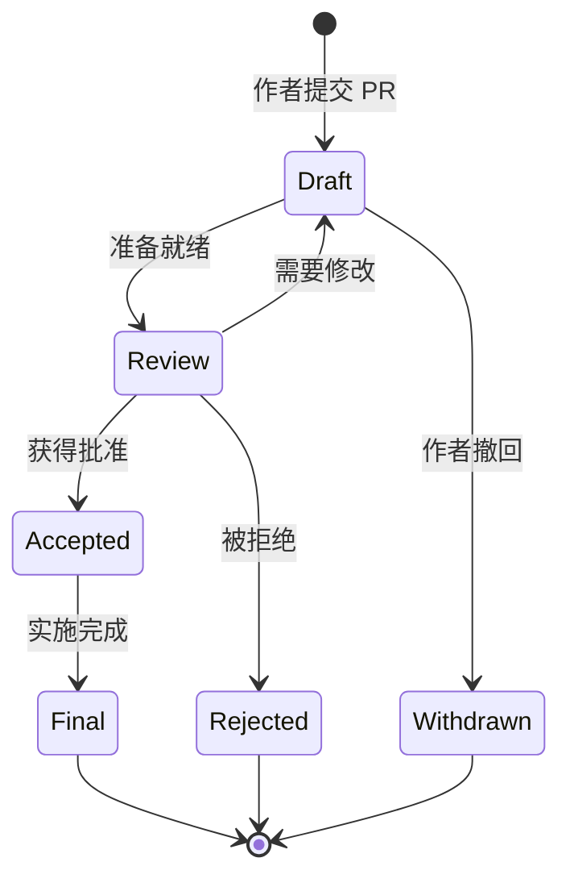
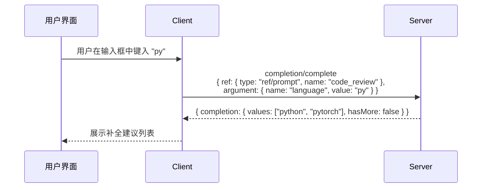
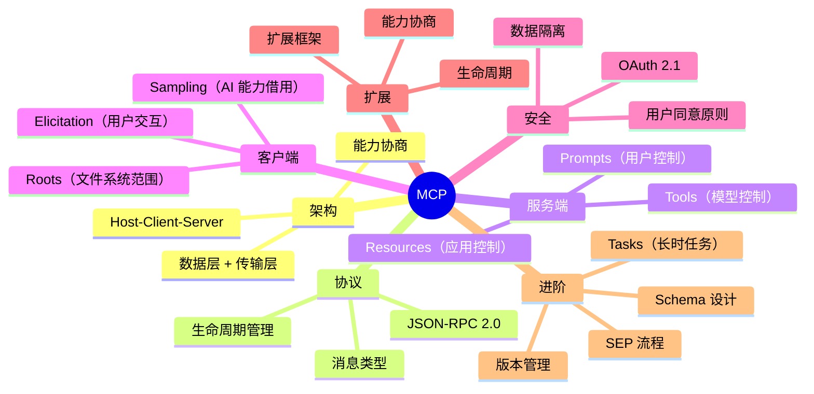

# 🔬 14 — 进阶主题

## 本章概览

前面的章节覆盖了 MCP 的核心知识。本章聚焦几个高级话题，适合需要深入理解协议细节或参与协议发展的读者。

---

## 🔄 Tasks — 持久化的长时任务

### 为什么需要 Tasks？

标准的 `tools/call` 请求是同步的——Client 发送请求，等待 Server 返回结果。但有些操作可能需要几分钟甚至几小时：

- 医疗数据分析（数小时的计算）
- 大规模代码迁移（处理数千个文件）
- 深度研究任务（需要多轮搜索和分析）
- CI/CD 流水线执行

对于这些场景，让 Client 一直保持连接等待既不现实也不可靠。

### Tasks 的设计思路

Tasks 引入了"发起并轮询"（fire-and-poll）模式：



### Task 生命周期



### 能力声明

Tasks 是实验性功能（2025-11-25 版本），需要双方在能力协商中声明：

```json
// Server 声明支持 Task 化的 tools/call
{
  "capabilities": {
    "tools": { "listChanged": true },
    "tasks": {
      "list": {},
      "cancel": {},
      "requests": {
        "tools": {
          "call": {}
        }
      }
    }
  }
}

// Client 声明支持 Task 化的 sampling
{
  "capabilities": {
    "sampling": {},
    "tasks": {
      "requests": {
        "sampling": {
          "createMessage": {}
        }
      }
    }
  }
}
```

### Task 与普通请求的区别

| 维度     | 普通请求（tools/call）    | Task 化请求              |
| -------- | ------------------------- | ------------------------ |
| 等待方式 | 同步等待响应              | 发起后轮询               |
| 连接要求 | 必须保持连接              | 可以断开再重连           |
| 适用场景 | 秒级响应的操作            | 分钟到小时级的操作       |
| 取消方式 | `notifications/cancelled` | `tasks/cancel`           |
| 结果获取 | 直接在响应中              | 通过 `tasks/result` 获取 |

### 使用场景示例

**代码迁移任务**：

```json
// 发起任务
{
  "method": "tools/call",
  "params": {
    "name": "migrate_codebase",
    "arguments": {
      "from_version": "python2",
      "to_version": "python3",
      "repository": "github.com/example/large-repo"
    },
    "_meta": {
      "taskId": "migrate-001"
    }
  }
}

// 轮询进度
{
  "method": "tasks/result",
  "params": { "taskId": "migrate-001" }
}

// 任务完成
{
  "result": {
    "state": "completed",
    "result": {
      "content": [
        { "type": "text", "text": "已完成迁移：2,847 个文件已更新，15 个文件需要人工审查。" }
      ]
    }
  }
}
```

---

## 📏 版本管理

### 版本格式

MCP 使用 **日期格式**（`YYYY-MM-DD`）而非语义化版本：

| 版本         | 日期       | 状态    |
| ------------ | ---------- | ------- |
| `2024-11-05` | 2024-11-05 | Final   |
| `2025-03-26` | 2025-03-26 | Final   |
| `2025-06-18` | 2025-06-18 | Final   |
| `2025-11-25` | 2025-11-25 | Current |
| `draft`      | 起草中     | Draft   |

### 版本递增规则

```
只有在"向后不兼容变更"时才递增版本。

向后兼容的变更（不递增版本）：
  ✅ 添加新的可选字段
  ✅ 添加新的方法（通过能力协商保护）
  ✅ 放宽现有约束

向后不兼容的变更（必须递增版本）：
  ❌ 删除或重命名现有字段
  ❌ 改变字段类型
  ❌ 改变现有方法的语义
  ❌ 添加新的必填字段
```

### 多版本支持

一个 Client 或 Server 可以支持多个协议版本：



---

## 📐 Schema 设计

### Schema 是 MCP 的真理之源

MCP 协议的所有数据结构都定义在 TypeScript 文件中（`schema/[version]/schema.ts`），然后自动生成 JSON Schema 和文档。

```
schema.ts (TypeScript) → 自动生成 → schema.json (JSON Schema)
                       → 自动生成 → schema.mdx (文档)
```

### 为什么选择 TypeScript 作为源？

1. **类型系统强大**：联合类型、泛型、交叉类型等
2. **开发者友好**：大多数 AI 开发者熟悉 TypeScript
3. **可执行**：可以直接运行类型检查
4. **自描述**：JSDoc 注释可以同时用于代码和文档生成

### Schema 结构概览

```typescript
// 基础消息类型
export interface JSONRPCRequest {
  jsonrpc: "2.0";
  id: RequestId;
  method: string;
  params?: {
    _meta?: { [key: string]: unknown };
    [key: string]: unknown;
  };
}

// 工具定义
export interface Tool {
  name: string;
  title?: string;
  description?: string;
  inputSchema: {
    type: "object";
    properties?: { [key: string]: unknown };
    required?: string[];
  };
  outputSchema?: { [key: string]: unknown };
  annotations?: ToolAnnotations;
}

// 资源定义
export interface Resource {
  uri: string;
  name: string;
  title?: string;
  description?: string;
  mimeType?: string;
  annotations?: ResourceAnnotations;
}
```

### 修改 Schema 的流程

```bash
# 1. 编辑 TypeScript 源文件
vim schema/draft/schema.ts

# 2. 生成 JSON Schema 和文档
npm run generate:schema

# 3. 检查生成结果
npm run check:schema

# 4. 格式化
npm run format:schema
```

---

## 📜 SEP（Specification Enhancement Proposal）

### 什么是 SEP？

SEP 是 MCP 的"规范增强提案"——类似于 Python 的 PEP 或 JavaScript 的 TC39 提案。任何人都可以提交 SEP 来提议修改或扩展 MCP 协议。

### SEP 类型

| 类型             | 用途               | 示例             |
| ---------------- | ------------------ | ---------------- |
| Standards Track  | 修改核心协议       | Tasks 功能       |
| Extensions Track | 添加扩展           | OAuth 客户端凭证 |
| Informational    | 提供指导和最佳实践 | 安全指南         |
| Process          | 修改治理流程       | 治理结构         |

### SEP 生命周期



### 重要的 SEP

| SEP 编号 | 标题           | 状态  | 核心内容                |
| -------- | -------------- | ----- | ----------------------- |
| 932      | Governance     | Final | MCP 治理结构和决策流程  |
| 1577     | Sampling+Tools | Final | Sampling 中支持工具调用 |
| 1686     | Tasks          | Final | 持久化长时任务支持      |
| 2133     | Extensions     | Final | 扩展框架设计            |

---

## 📊 日志系统

### 结构化日志

MCP 提供了标准化的日志通知：

```json
{
  "jsonrpc": "2.0",
  "method": "notifications/logging",
  "params": {
    "level": "warning",
    "logger": "weather-server",
    "data": "API 请求超时，正在重试..."
  }
}
```

### 日志级别

```
emergency → alert → critical → error → warning → notice → info → debug
  最严重                                                         最轻微
```

### 日志级别控制

Client 可以设置 Server 的最低日志级别：

```json
{
  "method": "logging/setLevel",
  "params": {
    "level": "warning"
  }
}
```

设置后，Server 只发送 `warning` 及以上级别的日志。

---

## 🧩 自动补全（Completions）

### 用途

为工具参数和 Prompt 参数提供自动补全建议，提升用户体验。

### 工作流程



### 请求格式

```json
{
  "method": "completion/complete",
  "params": {
    "ref": {
      "type": "ref/prompt",
      "name": "code_review"
    },
    "argument": {
      "name": "language",
      "value": "py"
    }
  }
}
```

`ref` 可以引用 Prompt (`ref/prompt`) 或 Resource (`ref/resource`)。

---

## 🏛️ 治理结构

MCP 作为开源项目，有清晰的治理结构：

```
Lead Maintainers（领导维护者）
  └── 拥有最终否决权
      │
Core Maintainers（核心维护者）
  └── 协议演进决策，双周会议
      │
Maintainers（组件维护者）
  └── 特定组件（SDK、扩展仓库）的管理
      │
Contributors（贡献者）
  └── 任何提交 Issue / PR / Discussion 的人
```

### 如何参与

1. **使用和反馈**：在 GitHub 上报告问题或建议
2. **贡献代码**：提交 PR 修复 bug 或改进文档
3. **提交 SEP**：提出新功能或改进提案
4. **构建生态**：开发 MCP Server 或 Client 实现

---

## 📌 总结与展望

### MCP 知识体系总览



### MCP 的发展方向

- **更多传输方式**：适应不同部署场景
- **更丰富的扩展生态**：UI 交互、认证方式、领域特定扩展
- **更强的安全性**：细粒度权限控制、审计日志
- **更好的开发者体验**：更多语言的 SDK、更完善的工具链
- **跨平台协作**：不同 AI 应用之间的 Server 共享

---

## 🎓 学习建议

1. **先理解核心概念**：Host-Client-Server 架构、三种原语
2. **动手实践**：从简单的 Tool-only Server 开始
3. **阅读规范**：遇到细节问题时查阅 `docs/specification/` 下的原始规范
4. **参与社区**：关注 GitHub 上的 Issues 和 Discussions
5. **构建真实项目**：将 MCP 集成到你的实际工作流中

---

> 🏠 **返回目录**：[README](./README.md)
>
> 恭喜你完成了 MCP 的完整学习之旅！🎉
